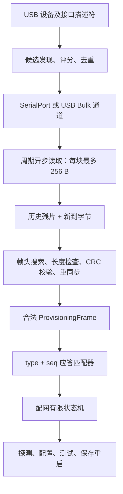
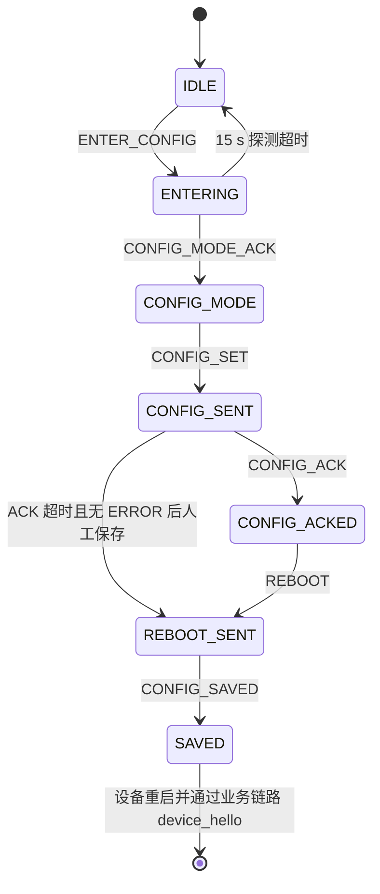

# 串口配网算法详细设计

> 本文描述当前大禹端串口配网的**算法与数据处理机制**，而非页面功能或操作说明。内容以当前代码为准，主要对应：
>
> - `entry/src/main/ets/provisioning/SerialProvisioningProtocol.ets`
> - `entry/src/main/ets/provisioning/UsbSerialProvisioningPort.ets`
> - `entry/src/main/ets/pages/Index.ets`

## 1. 算法目标与约束

串口配网算法要在 USB 串口这种“可能分片、粘包、混入启动日志、存在迟到回复”的字节流上，可靠完成以下计算任务：

1. 从多个 USB 接口中选出最可能的串口数据接口；
2. 将任意大小的读块还原为完整协议帧；
3. 排除伪帧头、未知类型、超长帧和 CRC 错帧，并尽快重新同步；
4. 用帧类型和序列号关联请求与异步回复；
5. 在复位时机不确定的情况下重复探测设备；
6. 抑制旧任务、迟到 ACK 和重复点击造成的状态回退；
7. 在 `CONFIG_ACK` 丢失但设备未明确报错时，保留继续保存重启的容错路径。

当前串口参数固定为 `115200 bit/s, 8 data bits, no parity, 1 stop bit`，即 115200/8N1。协议最大负载为 2048 字节。

## 2. 总体算法分层



算法上可分为四层：传输选择层、流式解析层、请求—应答关联层、会话状态层。上层只消费已经通过结构和 CRC 校验的帧，不直接解释原始 USB 读块。

## 3. 帧编码算法

### 3.1 帧布局

| 偏移 | 长度 | 字段 | 编码规则 |
|---:|---:|---|---|
| 0 | 1 | Head0 | 固定 `0xAA` |
| 1 | 1 | Head1 | 固定 `0x55` |
| 2 | 1 | Version | 当前固定 `0x01` |
| 3 | 1 | Type | 帧类型 |
| 4 | 1 | Seq | 1～255 循环使用，探测阶段可固定为 1 |
| 5 | 2 | Length | Payload 长度，大端序 |
| 7 | N | Payload | 0～2048 字节 |
| 7+N | 2 | CRC16 | 小端序，低字节在前 |

总帧长为：

```text
Lframe = 2 + 5 + N + 2 = N + 9
```

因此当前最大帧长为 2057 字节。

### 3.2 CRC16-MODBUS

CRC 初值为 `0xFFFF`，反射多项式为 `0xA001`。覆盖范围从 `Version` 到 `Payload`，**不包含帧头 `AA 55`，也不包含 CRC 自身**。

```text
crc ← 0xFFFF
for byte in Version..Payload:
    crc ← crc XOR byte
    repeat 8 times:
        if crc bit0 = 1:
            crc ← (crc >> 1) XOR 0xA001
        else:
            crc ← crc >> 1
return crc AND 0xFFFF
```

CRC 的时间复杂度为 `O(N)`，额外空间复杂度为 `O(1)`。它用于检测传输错误，不提供身份认证、保密性或抗篡改安全性。

### 3.3 配置负载序列化

`CONFIG_SET` 的负载不是 TLV，而是 UTF-8 编码的 JSON：

```json
{
  "ssid": "...",
  "password": "...",
  "brokerUrl": "...",
  "httpBridge": "...",
  "deviceId": "auto",
  "crypto": "sm4|aes",
  "transport": "mqtt|http"
}
```

编码过程为“对象 → JSON 字符串 → UTF-8 字节 → 帧封装 → CRC”。发送前必须满足 UTF-8 结果不超过 2048 字节。当前实现会正确编码合法代理对；孤立的 UTF-16 高代理项不会被补成替代字符，因此输入边界上应避免不完整代理项。

## 4. 流式拆帧与重新同步算法

### 4.1 输入和持久状态

每次底层读取最多申请 256 字节。解析器输入为：

```text
buffer = previous_remaining || incoming
```

其中 `previous_remaining` 是上次未形成完整帧的尾部。这样可统一处理：

- 一帧被拆成多个 USB 读块；
- 多帧粘在一个读块中；
- 帧前混入 ESP32 启动日志；
- 合法帧之后紧跟半帧；
- 错帧之后出现下一合法帧。

### 4.2 合法性判定顺序

解析器从 `offset` 开始执行如下判定，顺序不可随意交换：

1. 搜索连续帧头 `AA 55`；
2. 数据不足 3 字节：保留残片，等待下一批；
3. 检查版本必须为 `0x01`；
4. 数据不足 4 字节：保留残片；
5. 检查类型是否属于已知类型集合；
6. 数据不足 7 字节：保留残片；
7. 以大端序读取长度，并验证 `length ≤ 2048`；
8. 计算总长度 `length + 9`；
9. 数据足够时校验 CRC；
10. CRC 正确则输出帧并跨过整帧，否则仅右移 1 字节重新搜索。

“错误时只右移 1 字节”保证不会漏掉与错误候选帧重叠的下一个 `AA 55`。

### 4.3 不完整帧的抢占式重同步

通常遇到长度合法但数据尚不足的帧，应保留到下次读取。但若所谓“不完整帧”其实来自日志中的伪帧头，其长度字段可能让解析器长时间等待。当前算法会继续向后查找“更可信的帧头”。候选头必须同时满足当前已具备的条件：

- `AA 55` 匹配；
- 若版本字节已到达，则版本为 1；
- 若类型字节已到达，则类型已知；
- 若长度字段已到达，则长度不超过 2048。

找到后立即放弃前一个不完整候选，从新候选继续解析；找不到才保存尾部。这是一种基于协议先验的抢占式重同步算法。

### 4.4 解析伪代码

```text
function feed(previous, incoming):
    b ← concat(previous, incoming)
    offset ← 0
    frames ← []

    while offset + 2 ≤ len(b):
        if b[offset..offset+1] != AA55:
            offset ← offset + 1
            continue

        if header fields incomplete:
            break
        if version invalid or type unknown or length > 2048:
            offset ← offset + 1
            continue

        total ← length + 9
        if len(b) - offset < total:
            next ← findNextPlausibleHeader(b, offset + 1)
            if next exists:
                offset ← next
                continue
            break

        if receivedCRC != crc16(b[offset+2 .. offset+total-3]):
            offset ← offset + 1
            continue

        frames.append(decoded frame)
        offset ← offset + total

    return frames, b[offset..end]
```

### 4.5 正确性不变量

- 输出帧一定具有正确帧头、版本、已知类型、合法长度和正确 CRC；
- 未消费尾部一定可能成为后续合法帧的前缀，或将在下一次输入后被继续扫描；
- 一个合法完整帧不会因前方普通噪声而丢失；
- CRC 错帧不会进入状态机；
- 解析器不假设一次读取对应一帧。

### 4.6 复杂度

正常情况下，每个字节只被扫描和 CRC 计算常数次，时间复杂度近似 `O(B)`。由于错误不完整帧会调用向后搜索，构造型恶意输入在当前实现中可能退化到 `O(B²)`；串口短读块和 2048 字节负载上限使实际规模受限。拼接和切片会复制字节，空间复杂度为 `O(B)`。

## 5. USB 串口候选选择算法

### 5.1 后端优先级

当前先枚举 Raw USB 的 Bulk IN/OUT 接口；只有一个 Raw USB 候选都没有时，才回退到系统 `SerialPort` API。因此两种后端不是同时混排评分。

### 5.2 接口可行性过滤

一个 USB interface 只有同时存在 Bulk IN 和 Bulk OUT 端点才成为候选。每个候选还记录最近的 CDC 控制接口，以便设置 115200/8N1 和 DTR/RTS。

### 5.3 接口评分

对同一 USB 设备的多个 Bulk 接口，当前评分可写为：

```text
score = 100 × I(VID 属于显式串口厂商)
      + 40  × I(interface class = CDC DATA)
      + 20  × I(存在控制接口)
      + 10  × I(interface class = vendor-specific)
      - |dataInterfaceId - max(0, controlInterfaceId)|
```

显式识别的 VID 包括 WCH、CP210x、FTDI 和 Espressif。最后一项倾向选择物理描述符上更接近控制接口的数据接口。

### 5.4 设备去重

对于显式串口 VID，去重键主要由 `VID + PID + productName + manufacturerName` 构成，用于合并同一转换芯片暴露出的重复节点。发生冲突时保留得分更高的表示：显式 VID、存在数据/控制接口、描述信息更完整、接口号更小者优先。

该算法的代价是：两个完全相同且描述字符串相同的物理串口可能被合并。因此它是面向当前“单个待配网设备”场景的启发式算法，不是全局唯一设备识别算法。

### 5.5 芯片初始化策略

选中接口后按芯片族执行：

- CP210x：启用接口、设置 115200、设置 8N1、释放 DTR/RTS；
- CH340/CH341：厂商控制请求初始化、设置波特率和 LCR、释放 DTR/RTS；
- WCH CDC、Espressif CDC 和普通 CDC-ACM：发送 CDC line coding；
- 系统 SerialPort：直接设置 115200/8N1。

Raw USB 初始化失败时当前实现记录错误后继续尝试 Bulk 通信，这是“设备可能已由固件/系统预配置”的乐观容错策略。

## 6. 异步读取与写入串行化

读循环使用 50 ms 底层超时。若本次读到数据，下一次读取零延迟调度；若空闲，则延迟 5 ms，避免无数据时忙轮询。空闲类错误只按约 20 秒一次输出诊断日志，不改变连接状态。

Raw USB 写入由 `usbWriteInProgress` 互斥标志串行化；竞争写者每 2 ms 检查一次。单帧写超时为 1200 ms，并要求底层返回值严格等于帧长；负值和短写都视为失败，不进行“续写剩余部分”。系统 SerialPort 同样要求整帧写完。

此处保证的是**本进程内帧边界不交错**，不保证设备已接收或持久化；后者必须由 ACK 或后续状态帧确认。

## 7. 序列号与请求—应答匹配

### 7.1 序列号生成

普通请求序列号执行：

```text
seq ← (seq + 1) AND 0xFF
if seq = 0: seq ← 1
```

因此有效集合为 1～255，0 被跳过。自动探测阶段固定发送 `ENTER_CONFIG #1`，使 ESP32 在复位窗口内反复看到同一个幂等请求，而不是把每次重发误判为新事务。

### 7.2 单槽等待器

当前实现只有一个 pending 应答槽，字段为：

```text
(expectedType, expectedSeq, allowAnySeq, timer, resolver)
```

安装新等待器前会先把旧等待器解析为失败。因此算法天然限制为“同一时刻最多一个需要 ACK 的事务”。收到帧时：

```text
seqMatch = frame.seq == expectedSeq OR allowAnySeq

if frame.type == ERROR and pending exists and seqMatch:
    record error payload
    resolve(false)
else if frame.type == expectedType and seqMatch:
    record actual matched seq
    resolve(true)
```

超时也解析为 `false`。等待器必须在发送请求**之前**安装，以消除“设备快速回复发生在监听器建立之前”的竞态窗口。

### 7.3 当前匹配宽严策略

- 确认配网模式：`CONFIG_MODE_ACK` 必须与 `ENTER_CONFIG` 的 seq 严格一致；
- 确认配置：等待 `CONFIG_ACK` 时启用了 `allowAnySeq=true`，兼容部分 ESP32 固件回固定 seq 或错误回显 seq；
- 宽松匹配后仍记录实际 seq，并在 UI/日志中报告不一致。

因此 `CONFIG_ACK` 的 seq 当前是诊断信息而非强事务隔离条件。若未来允许并发配置多个事务，必须取消该宽松策略或引入会话 ID。

## 8. 配网有限状态机

当前状态按整数单调阶段表达：

| 状态 | 值 | 含义 |
|---|---:|---|
| `IDLE` | 0 | 未进入配网会话 |
| `ENTERING` | 1 | 正在发送/确认进入配网模式 |
| `CONFIG_MODE` | 2 | 已收到配网模式 ACK |
| `CONFIG_SENT` | 3 | 配置帧已开始发送 |
| `CONFIG_ACKED` | 4 | 收到配置 ACK |
| `REBOOT_SENT` | 5 | 已发送保存重启命令 |
| `SAVED` | 6 | 收到设备配置已保存通知 |



注意：这是主路径模型。当前接收处理器对合法 `CONFIG_ACK` 和 `CONFIG_SAVED` 会直接推进阶段，即使它们不是当前 pending 等待器匹配出的帧；这是为了容忍迟到 ACK，但也意味着状态机并非严格的封闭转移表。

## 9. 进入配网模式算法

### 9.1 人工启动探测

连接已建立后，在 15 秒窗口内每 1 秒发送一次固定的 `ENTER_CONFIG #1`。收到任意合法 `CONFIG_MODE_ACK` 后停止定时器并进入 `CONFIG_MODE`；15 秒无响应则回到 `IDLE`。

这种算法用于覆盖“用户按 Reset 的时刻未知”和“ESP32 仅在启动早期监听配网命令”的时间窗口。理论最大发送次数约 15～16 次，实际取决于事件循环调度和边界时刻。

### 9.2 自动探测与代际取消

自动探测使用 31 位正整数 `runId` 作为任务代际号。循环继续的必要条件是：

```text
autoProbeActive = true AND currentRunId = capturedRunId
```

取消时递增全局 runId。旧异步任务即使之后从 `await` 返回，也因代际不匹配而不能再更新主要探测结果。这是轻量级的 cancellation token 算法。

自动探测只锁定当前选中的候选接口，不轮询所有设备。探测失败后保留已打开串口，以便观察启动日志和继续手工操作。

## 10. 发送配置算法

### 10.1 前置确认

若当前串口仍打开且阶段至少为 `CONFIG_MODE`，复用已确认会话；否则最多进行 3 次严格确认：

```text
repeat at most 3 times:
    seq ← nextSeq()
    install wait(CONFIG_MODE_ACK, seq, 800 ms)
    send ENTER_CONFIG(seq)
    if matching ACK received: success
fail
```

确认时间上界约为 2.4 秒，加上发送调用和调度开销。

### 10.2 握手队列排空

确认成功后不会立即发送 JSON，而是观察累计接收字节数：

- 最少等待 2500 ms；
- 且最近 800 ms 没有新字节，认为握手回复队列已排空；
- 最多等待 5000 ms，超过上限仍继续。

其目的不是清空解析缓存，而是用“接收字节计数稳定”估计 ESP32 因重复 `ENTER_CONFIG` 产生的 ACK 已基本结束，从而降低旧 ACK 与配置事务在时间上的混叠。

### 10.3 CONFIG_SET 事务

```text
validate ssid and brokerUrl
ensure CONFIG_MODE
wait handshake drain
seq ← nextSeq()
payload ← UTF8(JSON(config))
rx0 ← receivedByteCount
install wait(CONFIG_ACK, seq, 3000 ms, allowAnySeq=true)
send CONFIG_SET(seq, payload)

if matching CONFIG_ACK:
    stage ← CONFIG_ACKED
else if matching ERROR:
    reject configuration
else:
    report rxByteCount-rx0
    permit later REBOOT as compatibility fallback
```

`CONFIG_SET` 日志隐藏完整帧负载，避免直接打印密码；诊断日志只显示掩码密码。但协议负载本身仍是串口明文 JSON，CRC 也不是加密。

### 10.4 ACK 缺失时的语义

3 秒未收到 ACK 并不被当前实现等同为“配置发送失败”。只要底层整帧写成功且没有匹配到 `ERROR`，算法允许用户继续发送 `REBOOT`。这是针对旧固件或 ACK 实现不完整的兼容策略。

因此必须区分三种结果：

1. **传输成功**：整帧已交给串口/USB 驱动；
2. **接收确认**：收到 `CONFIG_ACK`；
3. **持久化确认**：收到 `CONFIG_SAVED`，随后设备重启并在业务链路发送 `device_hello`。

三者不能相互替代。

## 11. 迟到帧、重复帧与状态回退抑制

`CONFIG_MODE_ACK` 可能在 `CONFIG_SET` 之后才到达。当前处理规则是：

```text
if currentStage <= CONFIG_MODE:
    stage ← CONFIG_MODE
else:
    log and ignore late CONFIG_MODE_ACK
```

这样旧握手 ACK 不会把 `CONFIG_SENT` 或 `CONFIG_ACKED` 回退到 `CONFIG_MODE`。重复 `CONFIG_ACK` 会重复赋值为同一阶段，具备幂等性。`provisioningBusy` 防止主要配置流程被重复点击并发执行。

仍需注意：当前对 `CONFIG_ACK`/`CONFIG_SAVED` 的全局处理未检查当前阶段和 pending seq，串口上残留的、CRC 合法的旧帧理论上可能推进状态。这是现实现选择的“可用性优先”权衡。

## 12. 故障分类与恢复决策

| 故障 | 检测算法 | 当前动作 |
|---|---|---|
| 普通日志/噪声 | 找不到合法帧头 | 逐字节跳过 |
| 版本不支持 | `version != 1` | 右移 1 字节重同步 |
| 未知类型 | 不在类型白名单 | 右移 1 字节重同步 |
| 负载过长 | `length > 2048` | 右移 1 字节重同步 |
| 帧未收全 | 总长不足 | 保留尾部或抢占到下一可信帧头 |
| CRC 错误 | 计算值不等于帧尾值 | 丢弃候选并重新搜索 |
| 串口空闲/读超时 | 50 ms 读无数据 | 保持连接，降频记录日志 |
| 短写 | `written != frame.length` | 本次发送失败 |
| 配网模式 ACK 超时 | 3 × 800 ms 无严格匹配 | 中止 CONFIG_SET |
| 配置 ACK 超时 | 3000 ms 无 ACK/ERROR | 允许容错 REBOOT |
| 旧自动探测任务 | runId 不匹配 | 静默失效，不覆盖新状态 |
| 迟到模式 ACK | 当前阶段已大于 CONFIG_MODE | 忽略，防止状态回退 |

## 13. 时间与吞吐估算

115200/8N1 每字节通常占 10 个串行比特，理论有效字节率约为：

```text
115200 / 10 = 11520 byte/s
```

若配置 JSON 长度为 `N`，仅在线路上的理论发送时间约为：

```text
Twire = (N + 9) × 10 / 115200 seconds
```

例如 512 字节负载的帧理论约需 45.2 ms。实际总耗时主要由握手排空的 2.5～5 秒、ACK 等待和设备处理时间决定，而不是 CRC 或 JSON 编码。

一次常规发送配置的算法时间上界近似为：

```text
T ≤ 配网模式确认 2.4 s + 排空 5 s + CONFIG_ACK 3 s + 调度/写入开销
  ≈ 10.4 s + 开销
```

若已经复用确认过的会话，则省去前 2.4 秒。

## 14. 安全性质

当前算法具备传输完整性检测，但不具备密码学安全性：

- SSID、Wi-Fi 密码和服务地址以明文 JSON 发送；
- CRC16 可被攻击者重新计算，不能验证发送者身份；
- seq 只有 8 位且循环，不具备防重放能力；
- USB 物理接触被隐含视为可信边界。

若安全模型需要抵抗恶意串口设备或物理窃听，应在 Payload 层增加带会话随机数的 AEAD，并让设备身份认证、密钥派生和防重放窗口成为状态机的一部分；不能只把 CRC 换成更长校验和。

## 15. 当前实现的关键不变量与已知边界

### 15.1 必须保持的不变量

1. 先安装 ACK 等待器，再发送对应请求；
2. 任意时刻只允许一个 pending ACK 事务；
3. `CONFIG_SET` 的敏感 Payload 不写入十六进制发送日志；
4. 只有通过 CRC 的帧才能进入状态处理器；
5. 后续状态不能被迟到 `CONFIG_MODE_ACK` 回退；
6. 自动探测的异步续体必须验证 runId；
7. 写调用必须验证完整帧长度。

### 15.2 已知算法边界

- `CONFIG_ACK` 允许任意 seq，兼容性高但事务隔离较弱；
- 全局帧处理器可被非 pending 的合法 ACK 推进状态；
- 序列号回绕后无法仅凭 seq 区分相隔 255 个事务的旧回复；
- Raw USB 设备去重键不包含稳定的物理拓扑路径，多个同型号设备可能被合并；
- 写入发生短写时不补发剩余字节；
- 流式解析使用数组拼接/切片，最大负载较小时简单可靠，但不是零拷贝实现；
- 自定义 UTF-8 解码器对畸形续字节的验证较宽松，错误内容只影响文本展示或 ERROR 文本，不影响帧结构和 CRC 判定；
- `CONFIG_SAVED` 后的最终在线确认依赖业务链路 `device_hello`，不属于串口状态机闭环。

## 16. 建议的算法级测试矩阵

### 16.1 帧解析性质测试

- 对任意合法帧，验证 `parse(encode(frame)) = frame`；
- 在帧的每个字节边界分片，逐片输入后结果一致；
- 多帧任意粘包后按原顺序输出；
- 帧前、中间和帧后插入随机噪声；
- 篡改每一个受 CRC 覆盖的字节，验证不输出原帧；
- 构造伪 `AA55 + 合法版本 + 合法类型 + 虚假长度`，后接合法帧，验证抢占式重同步；
- 长度为 0、2048、2049 的边界测试；
- 输入末尾仅含 `AA`、`AA55`、不完整固定头时验证残片保存。

### 16.2 状态机时序测试

- ACK 在等待器安装后、发送完成前到达；
- 严格 seq 不一致的 `CONFIG_MODE_ACK` 不满足确认；
- 任意 seq 的 `CONFIG_ACK` 满足当前兼容等待器并记录差异；
- `ERROR` 与目标 ACK 竞争到达时，先到者决定 pending 结果；
- `CONFIG_SET` 后收到迟到 `CONFIG_MODE_ACK`，阶段不回退；
- 取消自动探测后旧 Promise 恢复，不能覆盖新任务状态；
- ACK 丢失但串口有普通日志，3 秒后进入容错提示；
- 短写、负写入返回、USB 断开均不得被解释为已发送成功。

### 16.3 模糊测试关注点

对随机字节流持续调用解析器，应验证：不抛异常、不输出未通过 CRC 的帧、残留缓冲不会无界增长、最终插入的合法帧仍可恢复。还应特别统计大量 `AA55 01` 前缀下的最坏解析耗时，以发现 `findNextPlausibleHeader` 导致的二次复杂度退化。

## 17. 算法摘要

当前串口配网本质上是一个“**启发式通道选择 + 自同步二进制协议 + 单事务异步匹配 + 容错有限状态机**”系统：

- 通道层用 USB 描述符和芯片族评分选择最可信接口；
- 协议层用固定头、白名单、长度上限和 CRC 从噪声字节流中恢复帧；
- 事务层用 type/seq 和超时关联请求回复，并通过先监听后发送消除快速 ACK 竞态；
- 会话层用重复探测覆盖复位窗口，用 runId 取消旧任务，用阶段门控抑制迟到帧回退；
- 兼容层在 `CONFIG_ACK` 缺失但无明确错误时允许继续保存重启，以适配回复行为不一致的 ESP32 固件。

这套算法优先保证当前单设备、物理可信、固件版本可能不一致条件下的可恢复性。若扩展到并发多设备、恶意物理环境或严格事务语义，应首先加强设备唯一标识、ACK 严格关联、会话随机数与加密认证。
