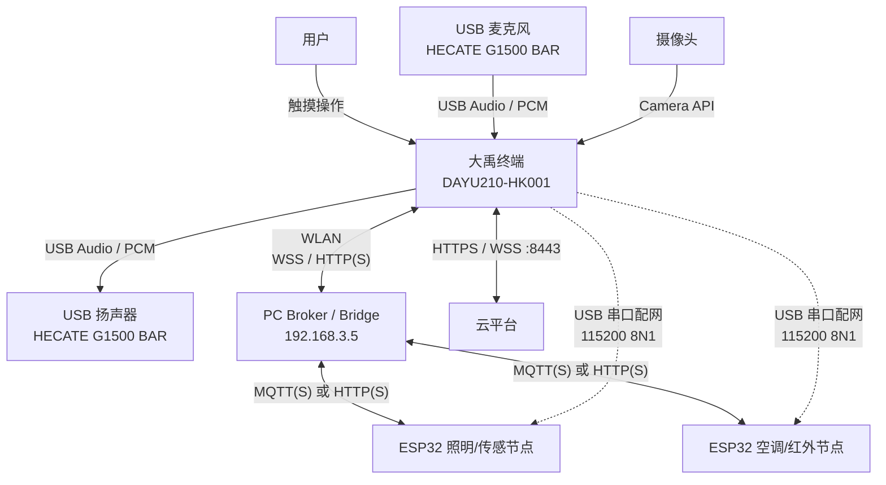
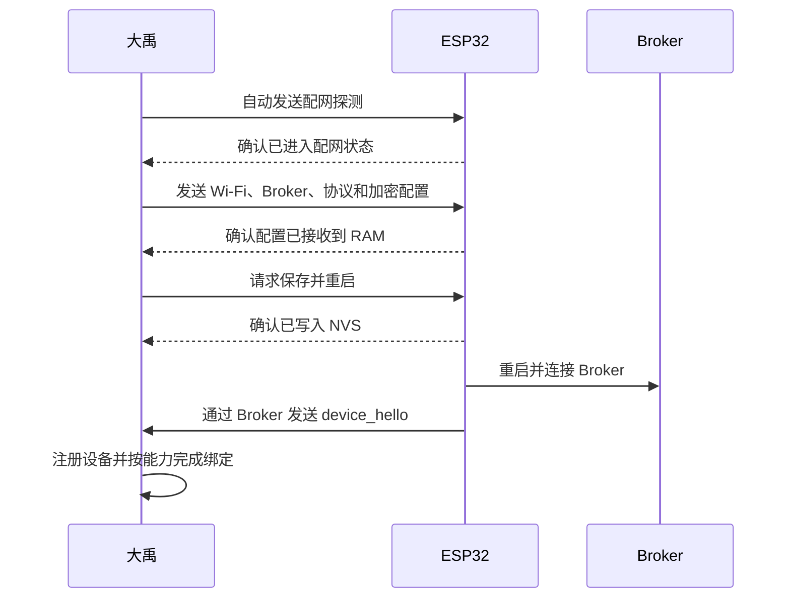
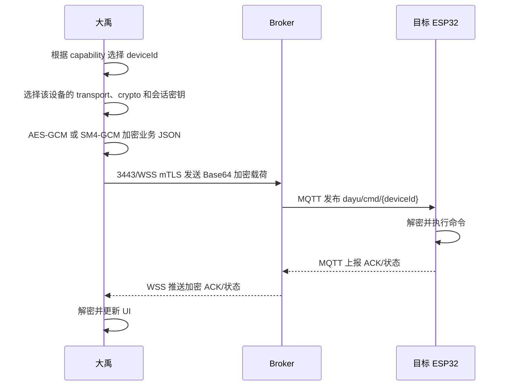
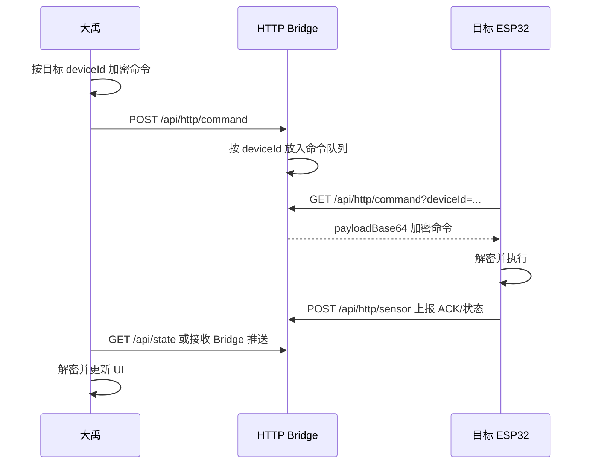

# 大禹智能家居终端硬件与通信接口说明

> 文档版本：V1.0  
> 整理日期：2026-07-16  
> 适用项目：My Smart Home（`com.example.my_smart_home`）  
> 整理依据：当前工程代码、Broker 运行状态和 DAYU210 现场检测结果

## 1. 系统定位

大禹在本项目中不仅是显示设备，也是一台完整的智能家居本地网关和人机交互终端，主要承担以下职责：

- 显示智能家居总览、设备状态和设置界面；
- 接收触摸、语音和人脸识别输入；
- 自动发现局域网内的 Broker；
- 维护多块 ESP32 的设备注册信息、能力和绑定关系；
- 根据设备 `deviceId` 路由灯、空调、门锁、传感器等业务；
- 执行 AES-GCM、SM4-GCM 加解密和 ECDH 密钥协商；
- 在 MQTT、HTTP 两种设备通信模式之间切换；
- 通过 USB 串口为新 ESP32 配网；
- 在本地完成语音唤醒、语音识别、语义解析和人脸识别；
- 向云端上报状态、获取天气并接收云端控制命令。

## 2. 系统硬件拓扑



业务消息在 MQTT、HTTP、WSS 等传输层之上，还会使用 AES-GCM 或 SM4-GCM 进行应用层加密。TLS 与 GCM 是两层独立的安全保护。

## 3. 当前硬件组成

| 组成 | 当前识别信息 | 接口或平台 | 主要作用 |
|---|---|---|---|
| 大禹主机 | `DAYU210-HK001` | HarmonyOS 设备环境，Linux 5.10.184，aarch64 | UI、本地网关、本地推理、加密和业务调度 |
| PC Broker 主机 | 当前地址 `192.168.3.5` | Node.js、Aedes、HTTP/HTTPS、WSS | MQTT Broker、HTTP 命令队列、设备发现和消息桥接 |
| ESP32 节点 | `esp32-XXXXXXXXXXXX` | Wi-Fi、MQTT/HTTP | 照明、空调、红外、门锁和传感器等业务 |
| 外接音频设备 | `HECATE G1500 BAR` | USB Audio、ALSA，card id 为 `BAR` | 麦克风采集和扬声器播放 |
| 摄像头 | 由系统 Camera API 枚举 | OpenHarmony Camera API | 人脸预览、采集、录入和识别 |
| 显示与触控 | 大禹本机屏幕 | 本机显示与触摸输入 | 竖屏控制界面和调试界面 |

## 4. 大禹物理接口和本机资源

### 4.1 WLAN

- 当前主要网络接口为 `wlan0`；
- 当前地址为 `192.168.3.103/24`；
- 广播地址为 `192.168.3.255`；
- 用于连接局域网 Broker、ESP32 所在网络和云平台。

### 4.2 有线以太网

- 系统存在 `eth0`，驱动为 `rk_gmac-dwmac`；
- 当前接口没有业务流量，也没有分配业务 IP；
- 可以作为后续有线网络备选，但不是当前主链路。

### 4.3 USB Host 串口

大禹作为 USB Host 连接 ESP32，用于新设备配网。当前代码支持：

- OpenHarmony 系统 SerialPort 接口；
- CDC ACM；
- CP210x；
- CH34x/CH341；
- 原始 USB Bulk IN/OUT 端点回退方式。

串口参数：

| 参数 | 当前值 |
|---|---:|
| 波特率 | 115200 |
| 数据位 | 8 |
| 校验位 | None |
| 停止位 | 1 |
| 简写 | 115200/8N1 |

USB 串口只用于配网、配置测试和调试，不承担日常灯光、空调等业务控制。

### 4.4 USB 麦克风和扬声器

现场识别到的 USB 音频设备为：

```text
HECATE G1500 BAR
Jieli Technology HECATE G1500 BAR
ALSA card id: BAR
```

这套 USB 音频设备同时为大禹提供麦克风输入和扬声器输出。

当前音频格式：

| 参数 | 当前值 |
|---|---:|
| 采样率 | 48 kHz |
| 采样格式 | Signed 16-bit Little Endian（S16_LE） |
| 声道 | 单声道 |
| 原始格式 | PCM |

大禹安装了 `smart_home_audio_service` 本机服务，通过 ALSA 的 `arecord` 和 `aplay` 直接访问 USB 音频设备。服务按 `BAR` 查找设备，因此 USB 声卡从 `card0` 变成 `card3` 时仍能重新识别。

### 4.5 摄像头

- 应用申请了 `ohos.permission.CAMERA` 权限；
- 通过 OpenHarmony Camera API 获取摄像头列表、预览输出和拍照输出；
- 用于本地人脸录入和身份识别；
- 人脸检测、质量判断、特征提取和模板比对在大禹本地完成；
- 当前软件只能确认 Camera API 可用，不能仅凭代码判断摄像头物理上是 USB 还是 MIPI 接口。

### 4.6 屏幕和触控

- 大禹本机屏幕是主要人机交互界面；
- 当前应用按竖屏方式布局；
- 触控操作用于设备控制、协议切换、加密切换、配网和调试。

### 4.7 HDC 调试接口

当前 HDC 目标为：

```text
c4010b545753432020f0e528ee0c6c00
```

HDC 用途包括：

- 安装和更新 HAP；
- 读取 `hilog`；
- 检查网络、音频和系统状态；
- 安装或更新 `smart_home_audio_service`；
- 调试应用和抓取截图。

HDC 属于开发和部署链路，不属于正式业务通信链路。

### 4.8 HDMI 音频

系统能够识别 `rockchip-hdmi0` 和 `rockchip-hdmi1` 音频设备，但当前语音输入输出不使用 HDMI，实际走 USB 音频设备 `HECATE G1500 BAR`。

## 5. 大禹本机开放和使用的网络接口

需要区分“监听接口”和“主动连接接口”。大禹真正对局域网监听的主要端口是 `1346/UDP`；其余大部分网络通信由大禹主动连接 Broker 或云端。

| 端口/协议 | 方向 | 绑定或对端 | 当前状态 | 用途 |
|---|---|---|---|---|
| `1346/UDP` | 局域网入站监听 | `0.0.0.0` | 已启用 | 接收 Broker Beacon，自动发现 Broker IP 和端口 |
| `19101/UDP` | 本机入站监听 | `127.0.0.1` | 已启用 | ALSA 服务向应用发送麦克风 PCM |
| `19102/TCP` | 本机连接 | `127.0.0.1` | 已启用 | 应用向 ALSA 播放服务发送提示音 PCM |
| `3443/WSS` | 局域网出站 | PC Broker | 当前主路径 | 大禹与 Broker 的 mTLS 双向安全 Bridge |
| `3000/HTTP` | 局域网出站 | PC Broker | 已启用 | `/api/state`、HTTP 指令入队和兼容接口 |
| `3444/HTTPS` | 局域网出站 | PC Broker | ESP32 TLS 模式使用 | ESP32 的安全 HTTP 上报和命令轮询 |
| `8883/MQTTS` | 局域网出站 | PC Broker | 服务已开放，大禹直连关闭 | 预留的大禹直接 MQTT mTLS 通道 |
| `8443/HTTPS` | 互联网出站 | `121.43.49.213` | 已启用 | 云端安全会话、天气、上报和控制 |
| `8443/WSS` | 互联网出站 | `121.43.49.213/mqtt` | 可切换 | 云端 MQTT-over-WebSocket mTLS 通道 |

### 5.1 大禹当前 MQTT 模式的实际第一跳

当前代码配置为：

```text
DAYU_DIRECT_MQTT_ENABLED = false
```

因此，大禹界面显示“MQTT 模式”时，表示 ESP32 最终通过 MQTT 收发业务消息，但大禹到 Broker 的第一跳并不是直接向 `8883` 发送二进制 MQTT 包，而是：

```text
大禹 → 3443/WSS mTLS Bridge → Broker → MQTT Topic → ESP32
```

这样做是因为当前大禹固件的 TLS Socket 对二进制发送存在限制，项目使用 Base64 JSON WebSocket Bridge 进行兼容。

## 6. PC Broker 当前开放端口

现场检查到 Node Broker 进程当前监听以下端口：

| 端口 | 服务 | 安全方式 | 当前状态 | 用途 |
|---:|---|---|---|---|
| `1883/TCP` | MQTT | 明文 | 已监听 | ESP32 MQTT 兼容入口 |
| `8883/TCP` | MQTTS | 双向 TLS | 已监听 | 大禹直接 MQTT 入口，校验客户端证书 |
| `8884/TCP` | MQTTS | 服务端 TLS | 已监听 | ESP32 安全 MQTT 入口 |
| `3000/TCP` | HTTP Bridge | 明文 HTTP | 已监听 | 状态、HTTP 上报和命令队列 |
| `3443/TCP` | BridgeWSS | 双向 TLS | 已监听且当前有连接 | 大禹主要安全桥接通道 |
| `3444/TCP` | HTTPS Bridge | 服务端 TLS | 已监听 | ESP32 安全 HTTP 入口 |
| `1351/UDP` | UDP Relay | 局域网 UDP | 已监听 | 接收 ESP32 UDP 并转发给大禹 |
| 目标 `1346/UDP` | Beacon 广播 | 局域网广播 | 每 5 秒发送 | 广播 Broker IP 和各服务端口 |

Broker 默认绑定 `0.0.0.0`，因此以上监听端口会对 PC 的可用网络接口开放。实际部署时还受 Windows 防火墙规则影响。

## 7. Broker HTTP/HTTPS 接口

以下接口在 `3000/HTTP` 和 `3444/HTTPS` 上共用同一套请求处理逻辑。

| 方法 | 路径 | 主要调用方 | 作用 |
|---|---|---|---|
| GET | `/api/state` | 大禹 | 读取聚合状态、缓存加密包、HTTP 上报记录、命令队列和密钥协商状态 |
| POST | `/api/http/sensor` | ESP32 | 上报 `{deviceId, topic, payloadBase64, crypto}` |
| POST | `/api/http/command` | 大禹 | 将加密命令放入指定 `deviceId` 的 HTTP 队列 |
| GET | `/api/http/command?deviceId=...` | ESP32 | 轮询并取走本设备的命令 |
| POST | `/api/encrypted/command` | 大禹/兼容路径 | 将加密载荷直接发布到 MQTT Topic |
| POST | `/api/light/control` | 旧版兼容入口 | 旧照明控制接口，客厅灯当前主路径走统一加密命令 |
| POST | `/api/udp/send` | 调试/兼容 | 由 Broker 代发 UDP 广播 |

HTTP 命令轮询有命令时的典型响应为：

```json
{
  "ok": true,
  "hasCommand": true,
  "deviceId": "esp32-XXXXXXXXXXXX",
  "commandId": "...",
  "topic": "dayu/cmd/esp32-XXXXXXXXXXXX",
  "payloadBase64": "...",
  "bytes": 80,
  "timestamp": 1784170000000
}
```

没有命令时返回：

```json
{
  "ok": true,
  "hasCommand": false,
  "deviceId": "esp32-XXXXXXXXXXXX"
}
```

## 8. MQTT Topic 和多设备路由

### 8.1 ESP32 身份

新 ESP32 使用 Base MAC 生成唯一 `deviceId`：

```text
esp32-XXXXXXXXXXXX
```

ESP32 重启上线后需要发送 `device_hello`：

```json
{
  "type": "device_hello",
  "deviceId": "esp32-XXXXXXXXXXXX",
  "name": "AC Controller",
  "room": "",
  "capabilities": ["ac", "ir_learning", "alarm"],
  "transport": "mqtt",
  "crypto": "sm4",
  "epoch": 1
}
```

### 8.2 能力声明

`capabilities` 表示一块 ESP32 能承担哪些业务。例如：

| capability | 含义 |
|---|---|
| `light` | 接收灯光控制并上报灯光状态 |
| `ac` | 接收空调控制并上报空调状态 |
| `ir_learning` | 支持空调红外学习和发射 |
| `alarm` | 支持告警相关业务 |
| 传感器相关能力 | 温湿度、烟雾、水浸、PIR 等 |

一块 ESP32 可以同时声明多个能力。因此温湿度传感器和灯连接在同一块 ESP32 上是支持的，不需要人为拆成两台逻辑设备。

### 8.3 当前 Topic 结构

| 用途 | Topic | 说明 |
|---|---|---|
| 大禹下发命令 | `dayu/cmd/{deviceId}` | ESP32 只订阅属于自己的命令 Topic |
| 设备注册和状态 | `device/{deviceId}/status` | `device_hello`、在线状态、协议和算法信息 |
| 传感器上报 | `device/{deviceId}/sensor` | 温湿度、烟雾、水浸、PIR 等数据 |
| 空调和红外 ACK | `device/{deviceId}/ac` | 空调状态、控制 ACK、红外学习 ACK |
| 通用 ACK | `device/{deviceId}/ack` | 其他命令的执行确认 |
| ECDH 公钥 | `key/ecdh/pub/{deviceId}` | 每个设备独立协商动态密钥 |
| 大禹统一订阅 | `device/+/+` | 接收所有 ESP32 的设备消息 |
| 大禹统一订阅 | `key/ecdh/pub/+` | 接收所有 ESP32 的 ECDH 公钥 |

旧版 `esp32` 设备仍可使用 `dayu/cmd`、`esp32/sensor`、`esp32/status` 和 `esp32/ac` 等兼容 Topic。

## 9. USB 串口配网协议

### 9.1 帧格式

| 字段 | 说明 |
|---|---|
| 帧头 | `0xAA 0x55` |
| 协议版本 | `0x01` |
| 类型 | 1 字节 |
| seq | 1 字节 |
| 长度 | 2 字节，大端 |
| payload | 最大 2048 字节 |
| CRC | CRC16-MODBUS，低字节在前 |

CRC 覆盖范围为 `version` 到 `payload`，不包含 `AA 55` 帧头。

### 9.2 帧类型

| 类型值 | 名称 | 方向和作用 |
|---:|---|---|
| `0x10` | `ENTER_CONFIG` | 大禹请求 ESP32 进入配网状态 |
| `0x11` | `CONFIG_MODE_ACK` | ESP32 确认已进入配网状态 |
| `0x20` | `CONFIG_SET` | 大禹发送网络和 Broker 配置 |
| `0x21` | `CONFIG_ACK` | ESP32 确认配置已接收到 RAM |
| `0x31` | `CONFIG_SAVED` | ESP32 确认配置已经写入 NVS |
| `0x40` | `CONFIG_TEST` | 大禹要求测试当前配置 |
| `0x41` | `CONFIG_TEST_RESULT` | ESP32 返回测试结果 |
| `0x50` | `REBOOT` | 大禹要求保存并重启 |
| `0x7F` | `ERROR` | ESP32 返回错误 |

### 9.3 配网内容

大禹向 ESP32 发送：

```json
{
  "ssid": "Wi-Fi 名称",
  "password": "Wi-Fi 密码",
  "brokerUrl": "mqtts://192.168.3.5:8884",
  "httpBridge": "https://192.168.3.5:3444",
  "deviceId": "auto",
  "crypto": "sm4",
  "transport": "mqtt"
}
```

`deviceId` 为 `auto` 时，ESP32 不保存字符串 `auto`，而是使用自己的 Base MAC 生成唯一身份。

### 9.4 配网主流程



## 10. MQTT 模式通信流程



## 11. HTTP 模式通信流程



HTTP 命令队列按 `deviceId` 隔离，每台设备只会取走自己的命令。当前单设备队列上限为 20 条。

## 12. 语音通信和处理流程

### 12.1 麦克风采集

```text
USB 麦克风
  → ALSA arecord
  → 48 kHz / S16_LE / Mono PCM
  → UDP 127.0.0.1:19101
  → 大禹应用 VoiceAudioBridge
  → 本地唤醒词模型
  → 本地 ASR 模型
  → 本地轻量语义解析
```

当前唤醒词为“小黄小黄”。唤醒、语音识别和语义解析均在大禹本地执行，不依赖云端语音 API。

### 12.2 扬声器播放

```text
大禹应用中的 WAV 提示音
  → 提取 PCM
  → TCP 127.0.0.1:19102
  → ALSA aplay
  → USB 扬声器
```

提示音播放期间，应用会暂时停止处理麦克风采集数据，避免扬声器声音重新触发唤醒和识别。

## 13. 人脸识别链路

```text
摄像头预览/拍照
  → 人脸检测
  → 图像质量判断
  → 本地 NCNN 特征提取
  → 与本地授权用户模板比对
  → 身份通过
  → 大禹向门锁对应 ESP32 下发加密控制命令
```

当前人脸图像、特征和授权用户模板主要在大禹本地处理，不通过 Broker 传输原始人脸图片。

## 14. 空调红外学习链路

空调红外学习不再使用 USB 串口，复用正常的加密 MQTT/HTTP 通信。

```text
大禹发送 learn-all
  → 路由到具有 ac / ir_learning 能力的 ESP32
  → ESP32 控制 ZJ-IR-V2
  → 依次学习开机、关机、温度+、温度-、制冷、制热
  → 每项通过 device/{deviceId}/ac 返回加密 ACK
  → 大禹按 index 更新学习进度
```

学习过程中使用同一个 `seq` 标识整次 `learn-all` 会话，六个单键结果通过 `index=1~6` 区分。

## 15. 安全机制

### 15.1 TLS 传输层

| 端口 | 安全方式 | 主要对象 |
|---:|---|---|
| `8883` | 双向 TLS | 大禹直接 MQTTS |
| `3443` | 双向 TLS WebSocket | 大禹 BridgeWSS |
| `8884` | 服务端 TLS | ESP32 MQTTS |
| `3444` | 服务端 TLS HTTPS | ESP32 HTTP Bridge |
| `8443` | HTTPS/WSS mTLS | 大禹与云端 |

Broker 本地 TLS 最低版本为 TLS 1.2。

### 15.2 应用层加密

业务载荷支持：

- AES-256-GCM；
- SM4-GCM。

当前 GCM 载荷格式为：

```text
12 字节 IV + 16 字节认证 Tag + Ciphertext
```

### 15.3 ECDH 动态密钥

- 每个 `deviceId` 独立进行 ECDH；
- 每个设备独立维护 AES 密钥、SM4 密钥和 `epoch`；
- MQTT 与 HTTP 共用同一套设备会话密钥；
- 切换当前控制目标时，大禹会读取目标设备自己的协议、算法和密钥状态；
- 红外 `learn-all` 期间，大禹会抑制自动 ECDH 恢复，避免中途换钥导致 ACK 解密失败。

### 15.4 静态密钥兼容

代码保留静态 AES/SM4 密钥，用于尚未完成 ECDH 协商或旧设备兼容。正常联调时应优先显示 ECDH 动态密钥；如果频繁回退到静态密钥，应检查设备上线、公钥 Topic、`epoch` 和解密失败恢复逻辑。

### 15.5 TLS 开关说明

TLS 和 AES/SM4-GCM 是两层独立保护：

- 关闭 TLS 后，业务载荷仍可保持 GCM 加密；
- 但连接身份、URL、Topic、配网元数据等可能在明文链路中暴露；
- 正式演示或实际部署建议给 ESP32 配置 `mqtts://...:8884` 和 `https://...:3444`。

## 16. 云端通信

当前代码配置：

```text
CLOUD_SYNC_ENABLED = true
Cloud endpoint = 121.43.49.213:8443
```

大禹可以通过 HTTPS 或 MQTT-over-WSS 连接云端，并在 TLS 之上再次使用 ECDH + AES/SM4-GCM 安全会话。

| 云端路径 | 用途 |
|---|---|
| `/api/secure/hello` | 建立 ECDH 安全会话并协商 AES/SM4 |
| `/api/secure/ingest` | 上报大禹心跳、设备消息、传感器和告警 |
| `/api/secure/control/pending` | 获取待执行的云端控制命令 |
| `/api/secure/control/ack` | 回传云端命令受理结果 |
| `/api/secure/app/weather` | 获取室外天气、温度和湿度 |

云端通信和局域网设备控制是两条不同链路。即使云端暂时不可用，大禹仍应能通过本地 Broker 控制 ESP32。

## 17. 当前运行状态快照

以下状态为 2026-07-16 检查结果，不代表固定配置：

| 项目 | 当前值 |
|---|---|
| 大禹型号 | `DAYU210-HK001` |
| 系统架构 | Linux 5.10.184 / aarch64 |
| 大禹 WLAN | `192.168.3.103/24` |
| Broker 地址 | `192.168.3.5` |
| 大禹到 Broker 主连接 | `192.168.3.103 → 192.168.3.5:3443`，Established |
| 外接音频 | `HECATE G1500 BAR`，USB Audio，当前 ALSA card0，id=`BAR` |
| ESP32 照明/传感节点 | `esp32-744DBD8A253C`，正在通过 HTTP 上报 AES 加密 sensor 数据 |
| ESP32 空调节点 | `esp32-94A990D24D10`，正在通过 HTTP 上报 AES 加密 ac 数据 |
| Broker Beacon | 每 5 秒向 `192.168.3.255:1346` 广播 |
| HDC | 目标设备在线 |

## 18. 当前未使用或不属于业务主链路的接口

| 接口或技术 | 当前情况 |
|---|---|
| 大禹直接 MQTT | 代码具备，当前 `DAYU_DIRECT_MQTT_ENABLED=false` |
| 大禹有线以太网 | 硬件接口存在，当前无业务流量 |
| HDMI 音频 | 系统可见，当前语音不使用 |
| 蓝牙 | 当前业务代码未使用 |
| Zigbee | 当前业务代码未使用 |
| LoRa | 当前业务代码未使用 |
| 串口日常控制 | 未使用；串口仅用于 ESP32 配网和调试 |
| 云端语音 API | 未使用；语音唤醒、ASR 和语义解析在本地完成 |

## 19. 维护和联调注意事项

1. 排障时先判断问题属于 USB 配网、局域网 Broker、ESP32 业务链路、云端链路还是大禹本机音频/摄像头链路。
2. 不要因为 Broker 的 `8883` 已监听，就认为大禹当前一定在直接使用 MQTTS；当前主连接是 `3443/WSS`。
3. 新 ESP32 配网成功并重启后，必须主动发送 `device_hello`，否则大禹无法获知其能力并完成自动绑定。
4. 一块 ESP32 上存在多个设备或传感器时，应在 `capabilities` 中完整声明全部能力。
5. HTTP 命令和状态必须携带正确的 `deviceId` 与匹配的 Topic，避免命令进入错误队列。
6. 协议、加密和 ECDH 密钥都按 `deviceId` 保存，不能再使用全局单设备变量覆盖其他 ESP32。
7. 正式部署建议关闭不需要的明文 `1883/3000` 入口，或至少通过防火墙限制访问范围。
8. 若更换 USB 麦克风或扬声器型号，需要同步修改音频服务中对 ALSA card id `BAR` 的匹配规则。
9. 摄像头的具体物理接口应在硬件 BOM 或接线图中补充，软件只能确认 Camera API 设备是否可用。

## 20. 接口归属速查

| 归属 | 接口或路径 |
|---|---|
| 大禹局域网监听 | `1346/UDP` |
| 大禹本机音频采集 | `127.0.0.1:19101/UDP` |
| 大禹本机音频播放 | `127.0.0.1:19102/TCP` |
| 大禹到 Broker | 当前主路径 `3443/WSS mTLS`，以及 `3000/HTTP` |
| ESP32 到 Broker | `1883/MQTT`、`8884/MQTTS`、`3000/HTTP`、`3444/HTTPS` |
| Broker 对外监听 | `1883`、`8883`、`8884`、`3000`、`3443`、`3444/TCP`，`1351/UDP` |
| Broker 自动发现 | 向大禹 `1346/UDP` 周期广播 |
| 大禹到云 | `121.43.49.213:8443` HTTPS/WSS |
| ESP32 配网 | USB Host 串口，115200/8N1，自定义帧和 CRC16-MODBUS |
| 开发部署 | HDC/USB |

## 21. 代码核对位置

| 内容 | 主要代码位置 |
|---|---|
| Broker 端口、HTTP API、Beacon、UDP Relay | `broker.js` |
| 大禹设备注册、控制路由和协议切换 | `entry/src/main/ets/pages/Index.ets` |
| MQTT/MQTTS 客户端 | `entry/src/main/ets/mqtt/MqttClient.ets` |
| 3443/WSS mTLS Bridge | `entry/src/main/ets/bridge/BridgeTlsClient.ets` |
| AES/SM4-GCM | `entry/src/main/ets/crypto/CryptoLayer.ets`、`Sm4Gcm.ets` |
| ECDH 和 per-device 密钥 | `entry/src/main/ets/crypto/KeyExchangeLayer.ets` |
| USB 串口和配网帧 | `entry/src/main/ets/provisioning/` |
| USB 音频和本地语音 | `entry/src/main/ets/voice/`、`tools/dayu-audio-service/` |
| 摄像头和人脸识别 | `entry/src/main/ets/face/` |
| 云端安全通信 | `entry/src/main/ets/cloud/` |

