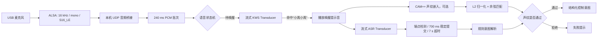
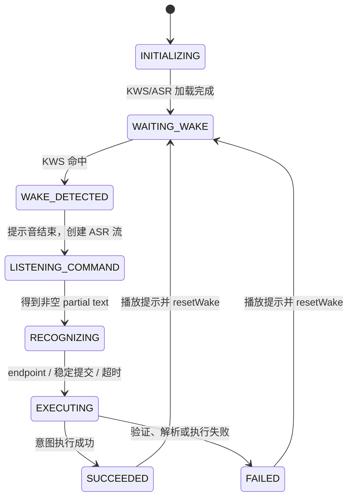

# 大禹语音助手算法设计与实现

> 文档定位：本文从算法、数据流和推理调度角度描述当前大禹端语音助手，不以界面功能或业务操作说明为主。
>
> 对应实现版本：OpenHarmony API 11、`sherpa_onnx 1.13.3`、唤醒词“小禹小禹”。

## 1. 算法目标与边界

当前语音助手采用完全本地的级联架构，将一个连续音频流拆成三个相互独立的推理问题：

1. **关键词检测（KWS）**：在持续音频中检测“小禹小禹”。
2. **自动语音识别（ASR）**：唤醒后把一段指令音频转换为中文文本。
3. **说话人验证（Speaker Verification，可选）**：判断当前语音是否与本地授权声纹匹配。

ASR 文本再经过确定性的规则解析器，得到结构化意图。系统没有使用大语言模型，也没有把音频上传到 broker 或云端。

本文中“项目算法”包括：

- 音频分帧、缓冲与调度；
- KWS、ASR、声纹模型的配置和调用策略；
- 状态机、端点判定与防重复提交；
- 声纹向量归一化、质量检查和匹配；
- 文本规范化和规则意图判定。

声学模型内部的网络训练过程、卷积或注意力层细节由所使用的 ONNX 模型决定，项目代码没有重新训练或重写这些网络。

## 2. 总体算法流水线



三个模型不是同一个模型：

| 阶段 | 模型 | 任务 | 运行方式 |
| --- | --- | --- | --- |
| KWS | streaming transducer encoder/decoder/joiner | 只检测唤醒词 | 持续运行，CPU 1 线程 |
| ASR | streaming transducer encoder/decoder/joiner | 中文语音转文字 | 唤醒后运行，CPU 2 线程 |
| 声纹 | 3D-Speaker CAM++ | 提取说话人向量 | 开启声纹保护或录入时运行，CPU 1 线程 |

这种级联方式的核心收益是：低成本 KWS 常驻，较重的 ASR 和声纹只在必要时工作。

## 3. 音频输入与数据表示

### 3.1 ALSA 采集参数

系统音频服务使用：

```text
采样率：16000 Hz
声道数：1
采样格式：Signed 16-bit Little Endian
period-size：3840 samples
buffer-size：15360 samples
```

单个采样占 2 字节，因此一个 ALSA period 对应：

```math
T_{period} = \frac{3840}{16000} = 0.24\ \text{s}
```

原始数据率为：

```math
R = 16000 \times 1 \times 16 = 256000\ \text{bit/s} = 32000\ \text{byte/s}
```

音频服务通过本机 UDP `127.0.0.1:19101` 把裸 PCM 送入 App。UDP 不提供重传、序号和乱序修复，但链路仅在 loopback 上运行，避免了真实网络中常见的丢包与抖动问题。

### 3.2 App 侧批处理

App 的目标批次大小为：

```math
B = 16000 \times 2 \times 0.24 = 7680\ \text{bytes}
```

收到的 UDP 数据先进入 `captureChunks`，累计到至少 7680 字节后拼成连续缓冲区，再作为一个 PCM 批次交给状态机。实际推理步长通常约为 240 ms。

### 3.3 PCM16 到 Float32

KWS 的异步入口直接接收 PCM16；ASR 和声纹入口接收 Float32。转换公式为：

```math
x_f[n] = \frac{x_{16}[n]}{32768}
```

因此输入范围近似为 `[-1, 1)`。代码显式按小端序还原有符号 16 位整数。

### 3.4 波形显示量

界面波形不是模型特征，而是一个低成本响度估计。每 8 个采样抽取 1 个，计算：

```math
RMS = \sqrt{\frac{1}{N}\sum_{n=1}^{N}x[n]^2}
```

```math
Peak = \max_n |x[n]|
```

最终显示量为：

```math
Level = \min\left(1,\max\left(\frac{RMS}{500},\frac{Peak}{4000}\right)\right)
```

显示回调最多每 50 ms 触发一次。由于当前音频批次约为 240 ms，实际刷新频率通常由音频批次而不是 50 ms 限制。

## 4. KWS 唤醒词检测算法

### 4.1 模型结构

KWS 使用流式 Transducer，由三个 ONNX 子模型组成：

- Encoder：从连续声学特征提取上下文表示；
- Decoder：根据已经输出的 token 建模标签历史；
- Joiner：融合 Encoder 与 Decoder 表示，输出下一 token 的分数。

模型文件名中的 `chunk-8-left-64` 表示它是面向流式场景导出的分块模型。Encoder 和 Joiner 使用 INT8 量化版本，Decoder 保持非 INT8 版本。

当前模型文件总大小约为 5.19 MiB：

| 文件 | 大小 |
| --- | ---: |
| KWS Encoder INT8 | 4.39 MiB |
| KWS Decoder | 0.72 MiB |
| KWS Joiner INT8 | 0.08 MiB |

### 4.2 声学前端与搜索参数

项目设置：

```text
sample_rate = 16000
feature_dim = 80
provider = cpu
num_threads = 1
modeling_unit = cjkchar
max_active_paths = 4
num_trailing_blanks = 1
keywords_score = 1.5
keywords_threshold = 0.35
```

80 维声学特征由 sherpa-onnx 前端生成。窗口长度、步长等未在项目代码中覆盖，使用模型和库的默认配置。

`max_active_paths = 4` 表示搜索时最多保留 4 条活跃路径，以较小搜索宽度换取低 CPU 占用。`num_trailing_blanks = 1` 允许关键词后出现至少一个 blank，再确认关键词边界。

### 4.3 唤醒词编码

当前 `keywords.txt` 为：

```text
x iǎo y ǔ x iǎo y ǔ :1.5 #0.35 @小禹小禹
```

其中：

- 前半部分是与 token 表兼容的拼音 token 序列；
- `:1.5` 是该关键词的分数增益；
- `#0.35` 是该关键词的检测阈值；
- `@小禹小禹` 是命中后返回的显示文本。

`keywords_score` 不是概率。它改变关键词路径在搜索中的相对竞争力；数值增大通常提高召回率，同时也可能增加误唤醒。`keywords_threshold` 用于最终接受判定；阈值提高通常降低误唤醒，同时增加漏唤醒。

### 4.4 KWS 缓冲与异步推理

待唤醒阶段维护两个不同目的的缓冲区：

1. **KWS 解码队列**：待送入模型的 PCM，最多保留约 2 秒。
2. **唤醒音频环形缓冲**：最近约 2 秒 PCM，供声纹验证使用。

KWS 解码最小触发量为：

```math
N_{min} = 16000 \times 0.12 = 1920\ \text{samples}
```

由于采集侧通常每次给出 3840 个采样，所以正常情况下每个 240 ms 批次都会触发一次 KWS 任务。

KWS 在 N-API 异步工作线程执行，并使用 `wakeDecodeInFlight` 保证同一时刻最多只有一个 KWS 解码任务。推理忙时，新 PCM 继续入队；队列超过 2 秒时丢弃最旧批次，防止推理速度短暂落后后内存无限增长和唤醒延迟持续累积。

每次任务最多执行 16 次 `DecodeKeywordStream`，限制单次任务占用时间。任务完成后若仍有积压数据，立即继续下一轮。

### 4.5 过期结果隔离

每次重置或切换 KWS 流都会递增 `wakeDecodeGeneration`。异步任务启动时记录 generation，完成时只有满足以下条件才接收结果：

```text
task.generation == currentGeneration
state == WAITING_WAKE
```

这相当于一个轻量的逻辑取消令牌，可防止旧任务在状态已切换到 ASR 后返回并触发第二次唤醒。

## 5. 流式 ASR 算法

### 5.1 模型与搜索

ASR 同样是 Transducer encoder/decoder/joiner，但与 KWS 使用不同模型。ASR 模型总大小约 23.52 MiB。

```text
sample_rate = 16000
feature_dim = 80
provider = cpu
num_threads = 2
modeling_unit = cjkchar
decoding_method = modified_beam_search
max_active_paths = 4
```

`modified_beam_search` 在每个时间步维护有限数量的候选 token 路径。相较纯 greedy search，它能利用多条候选降低局部最优错误；相较较宽 beam search，4 条活跃路径更适合大禹端侧 CPU。

### 5.2 热词偏置

当前 ASR 热词包括灯光和空调的常用表达，例如：

```text
开灯
打开客厅灯
点亮客厅灯
关闭客厅灯
打开空调
关闭空调
```

热词分数：

```text
hotwords_score = 2.0
```

热词偏置只影响解码路径分数，不等于硬编码输出。提高该分数会让目标领域词更容易胜出，但过高时可能把声学上相近的非目标语句错误拉向热词。

### 5.3 增量解码

每个 240 ms Float32 批次执行以下步骤：

1. `AcceptWaveform` 把新采样送入在线流；
2. 当流 ready 时循环解码，单批最多 16 次；
3. 读取当前 JSON 结果；
4. 检查 endpoint 标志；
5. 文本发生变化时更新 partial transcript。

最终结束时先调用 `OnlineStreamInputFinished`，再最多执行 64 次解码，把尚未消费的尾部特征尽量排空，然后读取 final transcript。

### 5.4 三种结束条件

指令识别由三种机制竞争结束，任意一种先满足即可提交：

#### A. sherpa-onnx Endpoint

当前端点参数：

```text
rule1_min_trailing_silence = 1.8 s
rule2_min_trailing_silence = 0.8 s
rule3_min_utterance_length = 8.0 s
```

其操作含义是：

- 尚无有效输出时，需要更长的尾静音才结束；
- 已有有效输出时，约 0.8 秒尾静音即可结束；
- 语句过长时按最大语句长度规则结束。

#### B. 稳定意图提前提交

当 partial transcript 已经能解析为灯光或空调控制意图，并且连续 700 ms 没有变化时，提前调用最终提交。

设最后一次文本变化时刻为 `t_change`，当前时刻为 `t`，则条件为：

```math
t - t_{change} \ge 700\ \text{ms}
```

同时要求当前文本仍与定时器创建时的候选文本完全相同。

开启声纹保护时禁用该优化，因为过早结束会缩短供声纹模型使用的有效语音，增加“语音太短”或误拒绝。

#### C. App 固定超时

唤醒提示音播放结束后，App 启动 7 秒定时器。7 秒内没有 endpoint 或稳定意图时，强制结束并读取 final transcript。

因为 App 超时为 7 秒，而 ASR 的第三条最大语句规则是 8 秒，所以当前正常流程中 7 秒 App 超时通常先于 rule 3 生效。

### 5.5 防重复提交

Endpoint、稳定意图定时器和 7 秒超时可能在相近时刻触发。`commandFinishing` 是一次性门闩：第一个进入 `finishCommand()` 的路径将其设为 `true`，后续路径立即返回。

该机制保证同一段语音最多生成一次结构化意图和一次设备控制。

## 6. 说话人验证算法

### 6.1 嵌入模型

声纹模型为：

```text
3dspeaker_speech_campplus_sv_zh-cn_16k-common.onnx
```

模型大小约 26.97 MiB，使用 CPU 单线程。它把一段可变长度语音映射为固定维度向量：

```math
f: \mathbb{R}^{T} \rightarrow \mathbb{R}^{d}
```

向量维度 `d` 不在 ArkTS 中硬编码，而是在模型加载后通过 C API 查询，以便校验已存档声纹与当前模型是否兼容。

### 6.2 延迟加载

启动阶段先异步加载 KWS 和 ASR，使助手尽快进入待唤醒状态；声纹模型随后在后台单独加载。这样降低初次可用延迟，但也意味着声纹模型尚未就绪且保护已开启时，系统采用拒绝执行策略，而不是绕过验证。

### 6.3 声纹录入

每位用户必须完成 3 轮采集，每轮默认 4200 ms。所有音频会送入 CAM++，同时 App 使用 RMS 做最低有效语音检查。

对一个音频批次：

```math
RMS_f = \sqrt{\frac{1}{N}\sum_{n=1}^{N}x_f[n]^2}
```

当 `RMS_f >= 0.005` 时，该批次的采样数计入“有效语音时长”。一轮至少需要：

```math
T_{speech} \ge 0.7\ \text{s}
```

需要注意：RMS 门限只用于判断采集是否过短，不会从模型输入中裁掉低能量帧。

### 6.4 L2 归一化

每个原始嵌入向量 `e` 保存前进行 L2 归一化：

```math
\hat{e} = \frac{e}{\|e\|_2}, \qquad
\|e\|_2 = \sqrt{\sum_{i=1}^{d} e_i^2}
```

当范数小于等于 `1e-6` 时认为向量无效并丢弃。

归一化后，两个向量的点积就是余弦相似度：

```math
s(a,b) = \hat{a}^{T}\hat{b} = \sum_{i=1}^{d}\hat{a}_i\hat{b}_i
```

### 6.5 三轮录入一致性

设三轮归一化向量为 `e1, e2, e3`，录入质量分数为所有两两余弦相似度的平均值：

```math
q = \frac{s(e_1,e_2) + s(e_1,e_3) + s(e_2,e_3)}{3}
```

当前接受条件：

```math
q \ge 0.35
```

三轮向量全部保存，不计算单一质心。这保留了同一用户在不同轮次中的自然变化。

### 6.6 在线验证音频范围

待唤醒阶段维护最近 2 秒的音频环形缓冲。唤醒命中后，如果声纹保护开启：

1. 创建声纹流；
2. 先送入唤醒前缓存，通常包含“小禹小禹”；
3. 再把后续指令音频同时送入 ASR 和声纹流；
4. ASR 结束时计算整段嵌入。

这种 pre-roll 设计增加了声纹可用语音长度，也减少了只说“开灯”等短指令时无法形成稳定嵌入的概率。

### 6.7 多用户匹配

对查询向量 `q`、用户 `u` 的第 `k` 个录入向量 `e_{u,k}`：

```math
S_u = \max_k s(q,e_{u,k})
```

全局最佳用户为：

```math
u^* = \arg\max_u S_u
```

最终接受条件：

```math
S_{u^*} \ge 0.60
```

匹配只考虑：

- 用户处于 enabled 状态；
- 模型版本一致；
- 向量维度一致；
- 用户至少有一个有效嵌入。

若有 `U` 个用户，每人 `K` 个样本，向量维度为 `d`，匹配复杂度为：

```math
O(UKd)
```

当前每人固定 3 个样本，用户规模较小时该复杂度可忽略。

使用最大相似度而不是均值或质心，提高了对同一用户不同说话状态的容忍度，但也会提高偶然匹配某一个样本的概率，因此阈值必须用真实用户数据校准。

### 6.8 当前声纹安全边界

当前算法是说话人相似度验证，不包含活体检测或反重放模型。因此录音回放、合成语音等攻击不在现有算法的可靠防护范围内。门锁等高风险指令仍由意图层阻断，不应只依赖当前声纹分数直接执行。

## 7. 规则意图解析算法

### 7.1 文本规范化

ASR 文本依次执行：

1. 删除全部空白；
2. 删除中英文常见标点；
3. 删除“请、帮我、麻烦、劳驾、给我”等礼貌词；
4. 去除首尾空白。

这一步不做分词、词性标注或句法分析。

### 7.2 判定优先级

规则按以下优先级执行：

```text
高风险门锁短语
  -> 控制阻断词
  -> 开/关动作互斥判定
  -> 设备词判定
  -> UNKNOWN
```

高风险短语优先级最高。只要包含“开门、打开门、解锁、门锁”之一，就返回 `REQUIRES_CONFIRMATION`，不会进入普通设备控制。

### 7.3 否定与疑问阻断

包含“不要、别、不用、不能、已经开、已经关、是否、吗”等词时，不把句子解释为直接控制命令。

该策略重点降低以下误执行风险：

```text
不要开灯
灯是不是开着
空调已经关了吗
```

### 7.4 动作互斥

分别计算：

```text
isOn  = 是否包含任一开启动作词
isOff = 是否包含任一关闭动作词
```

仅当二者异或成立时继续：

```math
isOn \oplus isOff = true
```

这避免一句话同时出现开和关时被任意解释。

### 7.5 设备与位置约束

灯光意图要求命中灯光设备词，同时不能命中卧室、厨房、卫生间等当前不支持的位置。因为通用词“灯”覆盖面很大，负向位置表优先用于避免把“打开卧室灯”错误路由到客厅灯。

空调意图要求命中“空调、冷气、制冷”之一。

解析结果为固定结构：

```text
type, target, power, temperature, sensor, rawText, normalizedText
```

当前实际解析 `LIGHT_SET` 和 `AC_SET` 的开关语义；`temperature` 和 `sensor` 字段已预留，但当前规则尚未产生温度设置或传感器查询意图。

### 7.6 复杂度

设规范化文本长度为 `L`，词表总数为 `M`，当前实现使用多次 `indexOf` 子串查找。概念复杂度约为：

```math
O(M \cdot L)
```

由于命令通常只有数个到十几个汉字，词表规模也很小，该方法比引入通用 NLU 模型更稳定、可解释且资源占用更低。

## 8. 状态机与算法调度

核心状态为：

```text
INITIALIZING
WAITING_WAKE
WAKE_DETECTED
LISTENING_COMMAND
RECOGNIZING
EXECUTING
SUCCEEDED / FAILED
VOICEPRINT_ENROLLING
ERROR / STOPPED
```

音频路由由状态决定：

| 条件 | PCM 去向 |
| --- | --- |
| `enrollmentActive` | 声纹录入流 |
| `WAITING_WAKE` | KWS + 2 秒唤醒环形缓冲 |
| `LISTENING_COMMAND` / `RECOGNIZING` | ASR；声纹保护开启时并行送声纹流 |
| 其他状态 | 不送模型 |

状态机不仅服务界面显示，它是音频算法的路由器。优先检查 `enrollmentActive`，保证录入时不会同时触发 KWS。

一次典型状态转移为：



## 9. 提示音与回声规避

提示音为 48 kHz、单声道、PCM S16_LE WAV。App 解析 RIFF/WAVE chunk，定位 `data` 块后只发送裸 PCM。

播放使用本机 TCP `127.0.0.1:19102`，每次发送最多 16384 字节。一个播放块约对应：

```math
T_{chunk} = \frac{16384}{48000 \times 2} \approx 170.7\ \text{ms}
```

播放期间设置 `suppressCapture = true`，清空输入批次，播放结束后再等待：

```math
T_{wait} = \frac{PCMBytes}{48000 \times 2} \times 1000 + 350\ \text{ms}
```

然后恢复采集。这是一种半双工回声规避策略，不是声学回声消除（AEC）。因此提示音播放期间用户不能有效插话，系统也不会把自己的提示音再次识别成命令或唤醒词。

## 10. 原生推理调度与并发安全

### 10.1 模型加载

KWS 与 ASR 在 N-API async work 中加载，避免阻塞 ArkTS UI 线程。声纹模型使用另一项 async work 延迟加载。

全局 `g_modelGeneration` 是模型生命周期令牌。`DestroyAll()` 会递增 generation；异步加载完成时如果 generation 已变化，则销毁刚加载的对象，不把过期模型安装到全局状态。

### 10.2 推理串行化

KWS 异步推理与 KWS reset/release 共享 `g_inferenceMutex`，避免一个线程销毁 stream 时另一个线程仍在解码。

ASR 和声纹入口是同步 N-API 调用，当前依赖 ArkTS 音频回调串行进入。原生层只维护一套 KWS、ASR 和声纹全局 stream，因此当前实现是单语音会话模型，不支持多个页面或多个并行识别会话。

### 10.3 API 11 TypedArray 兼容

API 11 的 `napi_get_typedarray_info` 在当前设备上返回 Float32Array 的字节长度，而不是标准语义中的元素数。项目使用：

```cpp
sampleCount = length / sizeof(float);
```

如果把字节长度直接当元素数，原生推理会越界读取约 4 倍数据，导致崩溃。该兼容处理是当前大禹镜像上的关键稳定性条件。

## 11. 资源与复杂度分析

### 11.1 模型文件规模

| 模型组 | 文件大小约计 |
| --- | ---: |
| KWS | 5.19 MiB |
| ASR | 23.52 MiB |
| 声纹 | 26.97 MiB |
| 合计 | 55.68 MiB |

文件大小不等于运行内存。ONNX Runtime 加载后还会产生权重映射、计算图、特征缓存和临时张量，实际峰值内存会更高。

### 11.2 显式音频缓冲

| 缓冲 | 上限或典型值 |
| --- | ---: |
| App 采集批次 | 7680 bytes |
| KWS 待解码队列 | 约 64000 bytes / 2 s |
| 唤醒声纹 pre-roll | 约 64000 bytes / 2 s |
| 单次播放发送块 | 16384 bytes |

这些显式 PCM 缓冲相对模型内存很小。

### 11.3 延迟构成

从用户说完唤醒词到进入命令监听的主要延迟为：

```math
L_{wake} = L_{captureBatch} + L_{KWS} + L_{prompt}
```

其中采集分批带来的平均等待约为半个批次，即约 120 ms，最坏接近 240 ms；KWS 为端侧推理时间；`L_prompt` 是完整唤醒提示音时长加播放保护余量。

从用户说完命令到提交的延迟主要为：

```math
L_{command} = \min(L_{endpoint}, L_{stable700}, L_{timeout7s}) + L_{finalDecode}
```

对已支持的短命令，700 ms 稳定提交通常是主要路径；开启声纹保护后该路径禁用，延迟更多由 endpoint 决定。

## 12. 参数调优方法

### 12.1 KWS

需要同时记录：

- **FRR（漏唤醒率）**：真实唤醒中未检测到的比例；
- **FAR（误唤醒率）**：非唤醒音频中错误触发的比例，建议按次/小时统计；
- 唤醒延迟的 P50、P95。

调参建议：

1. 固定 `keywords_score`，扫描 `keywords_threshold`；
2. 选定可接受 FAR 的阈值；
3. 再小范围调整 score 改善远场或低音量召回；
4. 每次只改变一个参数并保留测试集。

不要把同一批调参录音同时当最终评测集，否则结果会偏乐观。

### 12.2 ASR 与意图

ASR 应分别评估：

- 字错误率 CER；
- 支持命令上的意图准确率；
- 误执行率；
- 命令结束延迟。

对智能家居场景，意图准确率和误执行率通常比通用 CER 更重要。即使 ASR 文本有少量同音错误，只要规则仍得到正确意图，端到端结果仍可接受。

热词分数过低会漏掉领域词，过高会把非目标语音吸向目标词。端点静音过短会截断慢速说话，过长会让交互迟钝。

### 12.3 声纹

应采集两类分布：

- Genuine scores：同一授权用户在不同距离、日期、音量下的分数；
- Impostor scores：不同用户尝试控制时的分数。

对阈值 `tau`：

```math
FAR(\tau) = P(score \ge \tau \mid impostor)
```

```math
FRR(\tau) = P(score < \tau \mid genuine)
```

当前 `0.60` 是工程初始值，不应视为跨设备、跨麦克风恒定最优。最终阈值应根据真实环境下可接受的 FAR/FRR 选择。

## 13. 当前算法局限

1. 没有专用 VAD、降噪、波束形成或 AEC；端点主要依赖 ASR 内部规则。
2. 音频采用 240 ms 批次，调度开销低，但理论最低流式延迟高于 20~40 ms 小帧系统。
3. 提示音阶段采用完全抑制采集的半双工策略，不支持 barge-in。
4. KWS 只有一个关键词，未实现多唤醒词冲突消解。
5. ASR 热词静态编译在原生代码中，不能运行时更新。
6. 规则解析器不做上下文、多轮对话、实体纠错或模糊语义推断。
7. 声纹没有反录音、反合成等 anti-spoofing 能力。
8. 声纹匹配采用最大样本分数，用户规模变大后需重新评估阈值与多重比较效应。
9. 原生模块使用全局单例 stream，不支持并行语音会话。
10. USB 声卡通过 ALSA card id `BAR` 查找，算法链路依赖该硬件标识和本机特权服务。

## 14. 推荐的算法演进顺序

### 14.1 优先建立评测集

在继续加模型前，先建立带标签的本地评测数据：

- 多人、多距离、多噪声条件的唤醒词与负样本；
- 每条支持命令的多种说法；
- 同人跨时段声纹样本与不同人负样本；
- 对应的设备、距离、音量和环境标签。

### 14.2 降低前端延迟

将 ALSA period 和 App batch 从 240 ms 降到 80~120 ms，可以降低 KWS 和 partial ASR 的首包等待，但会增加 UDP 包数、ArkTS 回调频率和 N-API 调用开销。应以大禹 CPU 占用和丢包情况为约束做 A/B 测试。

### 14.3 增加 VAD 与 pre-roll

可在 ASR 前加入轻量 VAD：

- 静音时减少 ASR 解码；
- 用独立语音边界辅助 endpoint；
- 保留 200~500 ms pre-roll 防止裁掉首字。

### 14.4 改进声纹模板

用户增加后，可比较三种模板策略：

1. 当前的最大样本分数；
2. 多样本平均分数；
3. 归一化质心与离群样本剔除。

需要以真实 FAR/FRR 而不是单次体验选择方案。

### 14.5 扩展意图算法

在规则仍可控的前提下，优先增加：

- 数字温度抽取；
- 温湿度查询意图；
- 同义词表和 ASR 常见错词映射；
- 规则单元测试与冲突检测。

只有当规则复杂度和维护成本明显失控时，再考虑小型本地分类模型或远端语义模型。

## 15. 关键参数总表

| 参数 | 当前值 | 作用 |
| --- | ---: | --- |
| 采集采样率 | 16000 Hz | KWS、ASR、声纹输入 |
| 采集格式 | mono S16_LE | 原始 PCM |
| 采集批次 | 240 ms | App 推理调度粒度 |
| KWS 特征维度 | 80 | 声学前端输出维度 |
| KWS CPU 线程 | 1 | 计算资源限制 |
| KWS active paths | 4 | 搜索宽度 |
| KWS score | 1.5 | 关键词路径增益 |
| KWS threshold | 0.35 | 唤醒接受阈值 |
| KWS 最小提交批次 | 120 ms | 异步解码触发条件 |
| KWS 队列上限 | 2 s | 防止积压 |
| 声纹 pre-roll | 2 s | 包含唤醒词语音 |
| ASR CPU 线程 | 2 | 在线识别计算资源 |
| ASR active paths | 4 | modified beam 宽度 |
| ASR hotword score | 2.0 | 领域词偏置 |
| Endpoint rule 1 | 1.8 s | 无有效输出时尾静音 |
| Endpoint rule 2 | 0.8 s | 有有效输出时尾静音 |
| Endpoint rule 3 | 8.0 s | 最大语句规则 |
| App 命令超时 | 7.0 s | 最终兜底结束 |
| 稳定意图窗口 | 700 ms | 无声纹时提前提交 |
| 单轮声纹采集 | 4.2 s | 录入时长 |
| 最短有效语音 | 0.7 s | 录入质量门限 |
| 声纹 RMS 门限 | 0.005 | 有效语音计时 |
| 声纹录入轮数 | 3 | 每用户模板数 |
| 录入一致性阈值 | 0.35 | 三轮质量检查 |
| 在线声纹阈值 | 0.60 | 授权身份接受阈值 |
| 提示音采样率 | 48000 Hz | ALSA 播放输入 |
| 播放块大小 | 16384 bytes | TCP 分块发送 |

## 16. 代码索引

- 状态机、缓冲与推理调度：[VoiceAssistant.ets](../entry/src/main/ets/voice/VoiceAssistant.ets)
- 音频桥接、PCM 批处理与提示音播放：[VoiceAudioBridge.ets](../entry/src/main/ets/voice/VoiceAudioBridge.ets)
- 规则意图解析：[VoiceIntentParser.ets](../entry/src/main/ets/voice/VoiceIntentParser.ets)
- 声纹归一化、录入质量与匹配：[SpeakerProfileManager.ets](../entry/src/main/ets/voice/SpeakerProfileManager.ets)
- sherpa-onnx 原生配置与 N-API：[voice_inference.cpp](../entry/src/main/cpp/voice_inference.cpp)
- 原生接口类型：[libvoice_inference.d.ts](../entry/src/main/ets/types/libvoice_inference.d.ts)
- KWS 关键词配置：[keywords.txt](../entry/src/main/resources/rawfile/voice/kws/keywords.txt)
- ALSA 特权音频服务：[smart_home_audio_service.sh](../tools/dayu-audio-service/smart_home_audio_service.sh)
- 模型依赖与链接：[CMakeLists.txt](../entry/src/main/cpp/CMakeLists.txt)、[oh-package.json5](../entry/oh-package.json5)

## 17. 总结

当前大禹语音助手的算法本质是一个受状态机约束的本地流式级联系统：

```text
16 kHz PCM
  -> 低成本流式 KWS
  -> 唤醒后流式 Transducer ASR
  -> 可选 CAM++ 声纹验证
  -> 可解释的规则意图解析
  -> 结构化控制接口
```

它的主要设计取舍是：用较小搜索宽度、INT8 模型、有限缓冲和按需推理控制端侧资源；用 endpoint、700 ms 稳定窗口和 7 秒超时共同控制交互延迟；用高风险短语优先阻断和可选声纹验证约束误执行风险。
