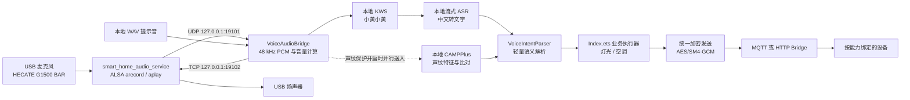
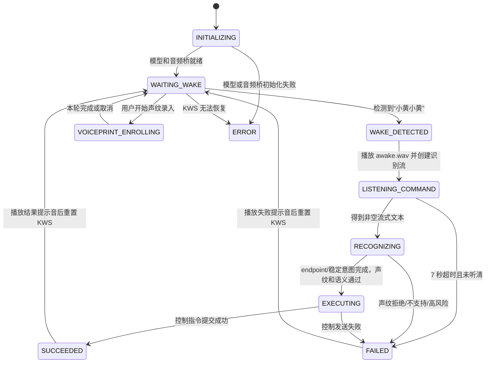
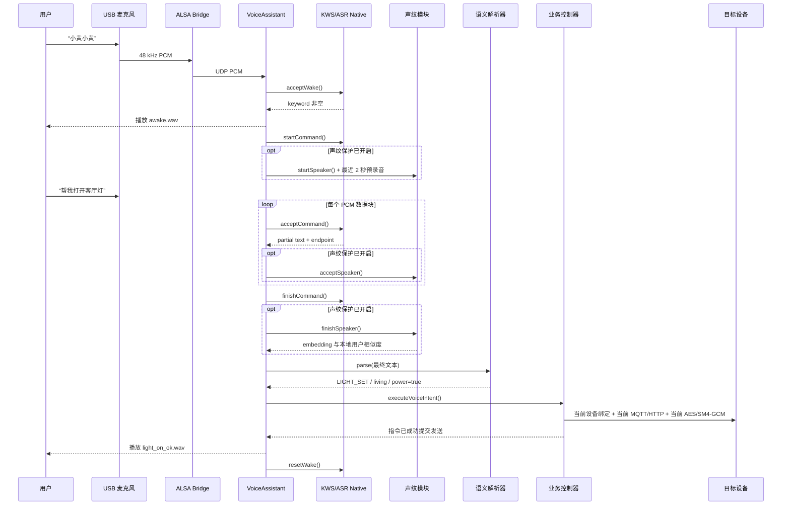

# 大禹智能家居语音模块完整实现逻辑

> 文档基于当前项目代码整理，更新时间：2026-07-17。
>
> 本文描述的是已经落地的实现，不是规划方案。语音采集、唤醒、识别、语义解析和声纹识别均在大禹本地完成；只有最终的设备控制指令会进入现有 MQTT/HTTP 加密通信链路。

## 1. 模块目标与当前能力

语音模块实现了以下完整闭环：

1. 持续采集 USB 麦克风音频。
2. 本地监听唤醒词“小黄小黄”。
3. 唤醒后播放“我在”提示音。
4. 对后续语音进行流式中文识别。
5. 可选地进行本地声纹身份验证。
6. 将识别文本解析为结构化智能家居意图。
7. 调用灯光或空调原有控制逻辑。
8. 通过当前设备绑定、通信协议、加密算法和会话密钥发送指令。
9. 播放成功、失败或声纹拒绝提示音。
10. 自动恢复到唤醒词监听状态。

当前支持的业务意图为：

| 意图 | 当前目标 | 示例说法 | 执行结果 |
| --- | --- | --- | --- |
| 开灯 | 绑定了 `light` 能力的设备 | 开灯、打开客厅灯、点亮客厅灯、开启照明 | 下发 LED 开启指令 |
| 关灯 | 绑定了 `light` 能力的设备 | 关灯、关闭客厅灯、熄灭灯光 | 下发 LED 关闭指令 |
| 开空调 | 绑定了 `ac` 能力的设备 | 打开空调、开启冷气 | 使用当前温度和模式下发空调开启指令 |
| 关空调 | 绑定了 `ac` 能力的设备 | 关闭空调、关掉冷气 | 使用当前温度和模式下发空调关闭指令 |
| 门锁相关语句 | 不直接执行 | 开门、解锁、打开门锁 | 拒绝执行，要求人脸或手动确认 |

当前不是固定句子逐条匹配。系统会先去掉空格、标点和“请、帮我、麻烦”等礼貌词，再根据设备词、动作词、否定词和位置词进行轻量语义判断。

## 2. 总体架构



### 2.1 分层职责

| 层级 | 主要文件 | 职责 |
| --- | --- | --- |
| 系统音频服务 | `tools/dayu-audio-service/smart_home_audio_service.sh` | 直接调用 ALSA，采集麦克风并播放 PCM |
| ArkTS 音频桥 | `entry/src/main/ets/voice/VoiceAudioBridge.ets` | 接收 PCM、转换为浮点采样、计算音量、发送提示音 |
| 语音流程状态机 | `entry/src/main/ets/voice/VoiceAssistant.ets` | 串联唤醒、ASR、声纹、意图、执行和恢复 |
| 本地推理 N-API | `entry/src/main/cpp/voice_inference.cpp` | 封装 sherpa-onnx KWS、ASR 和说话人特征提取 |
| 语义解析 | `entry/src/main/ets/voice/VoiceIntentParser.ets` | 将自然语言转成灯光/空调意图，拦截高风险指令 |
| 声纹用户管理 | `entry/src/main/ets/voice/SpeakerProfileManager.ets` | 录入质量检查、余弦相似度匹配和本地持久化 |
| 业务与界面 | `entry/src/main/ets/pages/Index.ets` | 展示状态、管理声纹、执行设备控制、接收 ACK |
| 录音诊断工具 | `entry/src/main/ets/voice/VoiceRecorderTest.ets` | 独立录音、保存 WAV、回放，用于排查音频链路 |

## 3. 硬件与系统音频链路

### 3.1 外接音频设备

大禹连接一套 USB 音频设备，当前服务按 ALSA 声卡 ID `BAR` 自动查找。项目调试界面中显示的设备名称为 `HECATE G1500 BAR`，同时提供麦克风输入和扬声器输出。

服务不会写死 `card0` 或 `card3`。每轮采集或播放前都会扫描：

```text
/proc/asound/card*/id
```

找到内容为 `BAR` 的声卡后，再构造 `hw:<card>,0` 或 `plughw:<card>,0`，因此 USB 枚举序号改变后仍能工作。

### 3.2 开机音频服务

系统服务名为：

```text
smart_home_audio_service
```

启动配置位于：

```text
/vendor/etc/init/smart_home_audio_service.cfg
```

服务以 root 身份运行，启动后并行维护采集循环和播放循环：

- 采集：`arecord -> UDP 127.0.0.1:19101`
- 播放：`TCP 127.0.0.1:19102 -> aplay`
- PCM 格式：48 kHz、单声道、16 bit、有符号小端序
- ALSA period：960 帧，约 20 ms
- ALSA buffer：3840 帧，约 80 ms
- 麦克风采集音量：95%
- PCM 播放音量：90%
- 自动增益：开启

服务日志保存在：

```text
/data/local/tmp/smart_home_audio_service.log
```

### 3.3 为什么使用本机 ALSA Bridge

当前大禹固件上的 OpenHarmony USB `AudioCapturer/AudioRenderer` 路由不能稳定访问这套 USB 声卡，因此项目通过本机系统服务直接访问 ALSA。应用与服务仅在回环地址通信，不向局域网开放音频端口。

虽然当前实际采集由 ALSA Bridge 完成，应用清单仍声明了 `ohos.permission.MICROPHONE`，便于保持语音功能权限语义完整。

## 4. 应用启动与模型加载

页面出现时，`Index.aboutToAppear()` 调用 `setupVoiceAssistant()`：

1. 将 `SpeakerProfileManager` 注入 `VoiceAssistant`。
2. 注册状态、音量、业务执行和声纹结果回调。
3. 延迟 500 ms 调用 `VoiceAssistant.start()`。
4. 同时从本机加载已经保存的声纹用户。

`VoiceAssistant.start()` 的顺序为：

1. 状态切换为 `INITIALIZING`。
2. 异步加载 KWS 和 ASR 模型。
3. 绑定 `127.0.0.1:19101/UDP`，开始接收 PCM。
4. 创建新的唤醒词流。
5. 状态切换为 `WAITING_WAKE`。
6. 在后台异步加载 CAMPPlus 声纹模型。

KWS/ASR 先就绪，声纹模型后加载，因此声纹模型较大时不会阻塞基础唤醒功能。

页面退出时会清理所有定时器、关闭 UDP/TCP socket、释放本地推理模型和流，并切换到 `STOPPED` 状态。

## 5. 本地模型与推理参数

项目使用 `sherpa_onnx 1.13.3`，N-API 动态库名为 `libvoice_inference.so`，底层链接：

- `sherpa-onnx-c-api`
- `onnxruntime`
- `libace_napi.z.so`
- `librawfile.z.so`

### 5.1 模型资源清单

| 模块 | 资源目录 | 大小约 | 用途 |
| --- | --- | ---: | --- |
| KWS | `rawfile/voice/kws/` | 5.20 MiB | 持续监听“小黄小黄” |
| ASR | `rawfile/voice/asr/` | 23.58 MiB | 唤醒后的流式中文识别 |
| Speaker | `rawfile/voice/speaker/` | 26.97 MiB | CAMPPlus 说话人特征提取 |
| Prompts | `rawfile/voice/prompts/` | 1.64 MiB | 唤醒、成功、失败和拒绝提示音 |
| 合计 | `rawfile/voice/` | 57.39 MiB | 全部本地资源 |

### 5.2 KWS 参数

KWS 使用在线 Transducer 模型：

- 特征采样率：16 kHz
- 特征维度：80
- CPU 线程：1
- provider：CPU
- 建模单元：CJK 字符
- `max_active_paths = 4`
- `num_trailing_blanks = 1`
- `keywords_score = 1.5`
- `keywords_threshold = 0.35`

关键词文件当前只配置：

```text
x iǎo h uáng x iǎo h uáng :1.5 #0.35 @小黄小黄
```

### 5.3 ASR 参数

ASR 同样使用在线 Transducer 模型：

- 特征采样率：16 kHz
- 特征维度：80
- CPU 线程：2
- provider：CPU
- 解码方法：`modified_beam_search`
- `max_active_paths = 4`
- 热词权重：2.0
- 启用 endpoint 检测
- 规则 1 最小尾部静音：1.8 秒
- 规则 2 最小尾部静音：0.8 秒
- 规则 3 最长语句窗口：8 秒

当前热词覆盖开关灯和开关空调的常见说法，用于提高这些词在流式识别中的命中率。热词只是识别偏置，最终是否执行仍由 `VoiceIntentParser` 判断。

### 5.4 声纹模型参数

声纹模型为：

```text
3dspeaker_speech_campplus_sv_zh-cn_16k-common.onnx
```

配置为 CPU、单线程。模型输出一个固定维度的说话人 embedding，具体维度由运行时通过 `SherpaOnnxSpeakerEmbeddingExtractorDim()` 获取，不在 ArkTS 中写死。

### 5.5 48 kHz 与 16 kHz 的关系

硬件桥输出 48 kHz PCM，ArkTS 将原始采样率和 `Float32Array` 一起传入 sherpa-onnx。模型特征配置为 16 kHz，采样率转换由 sherpa-onnx 的音频输入/特征层处理，应用不额外保存或离线转换整段录音。

## 6. PCM 接收与音量计算

`VoiceAudioBridge` 监听 `127.0.0.1:19101/UDP`。每个 UDP 数据块按 S16_LE 解码：

```text
int16 PCM -> [-1, 1] Float32Array
```

每 50 ms 最多上报一次音量，音量同时参考 RMS 和峰值：

```text
level = min(1, max(rms / 500, peak / 4000))
```

该音量用于总览页麦克风动画和语音助手波形，不参与 KWS/ASR 的判定。

PCM 到达 `VoiceAssistant.handlePcm()` 后只会进入当前状态对应的分支：

| 当前状态 | PCM 去向 |
| --- | --- |
| 声纹录入中 | 送入声纹提取流 |
| `WAITING_WAKE` | 送入 KWS，同时保存最近 2 秒环形缓存 |
| `LISTENING_COMMAND` / `RECOGNIZING` | 送入 ASR；声纹保护开启时也并行送入声纹流 |
| 其他状态 | 不进行语音推理 |

## 7. 语音助手状态机

| 状态 | 中文界面状态 | 含义 |
| --- | --- | --- |
| `INITIALIZING` | 正在初始化 | 正在加载本地模型 |
| `WAITING_WAKE` | 待唤醒 | 持续监听“小黄小黄” |
| `WAKE_DETECTED` | 我在 | 已检测到唤醒词并播放提示音 |
| `LISTENING_COMMAND` | 我在听 | 已创建 ASR 流，等待指令 |
| `RECOGNIZING` | 识别中 | 已有流式文字结果 |
| `EXECUTING` | 正在执行 | 语义和声纹已通过，正在调用业务控制器 |
| `SUCCEEDED` | 已执行 | 控制指令成功提交发送 |
| `FAILED` | 执行失败 | 未听清、不支持、声纹拒绝或业务发送失败 |
| `ERROR` | 助手异常 | 模型、音频 socket 或恢复流程异常 |
| `VOICEPRINT_ENROLLING` | 采集声纹 | 正在录入某一轮声纹 |
| `STOPPED` | 已停止 | 页面退出或主动释放 |



## 8. 一次语音控制的完整时序



## 9. 唤醒后的流式识别策略

### 9.1 固定超时

唤醒后命令窗口为 7000 ms。到期后无论 endpoint 是否触发都会调用 `finishCommand()`。

### 9.2 Endpoint 提前结束

ASR 返回 `endpoint = true` 且已经有非空文字时，会立即结束当前识别流，不必等满 7 秒。

### 9.3 700 ms 稳定意图提前提交

当声纹保护关闭时，如果当前流式文本已经能明确解析为客厅灯或空调开关指令，并且 700 ms 内文字没有变化，系统会提前调用 `finishCommand()`。

这使“开灯”“关空调”等短指令无需等待 endpoint 的完整静音窗口。

声纹保护开启时不使用该优化，因为声纹提取需要更完整的语音片段。此时优先保证身份特征质量，再执行指令。

### 9.4 防止重复结束

`commandFinishing` 保证超时、endpoint 和 700 ms 稳定计时器同时到达时，只有第一条路径能够完成当前命令，避免重复执行。

## 10. 本地轻量语义解析

`VoiceIntentParser` 不依赖大语言模型，也不调用云端 API。其处理顺序为：

1. 删除所有空白字符。
2. 删除中英文常用标点。
3. 删除“请、帮我、麻烦、劳驾、给我”等礼貌词。
4. 优先检查门锁高风险短语。
5. 检查否定、疑问或状态描述阻断词。
6. 检测动作词和设备词。
7. 输出结构化 `VoiceIntent`。

### 10.1 灯光词表

设备词包括：

```text
客厅灯、灯光、照明、电灯、灯
```

开启动作包括：

```text
打开、开启、启动、点亮、亮起、开
```

关闭动作包括：

```text
关闭、关掉、熄灭、停掉、停止、关
```

当前只控制客厅灯。文本中出现“卧室、厨房、卫生间、浴室、阳台、书房、餐厅”时不会错误映射到客厅灯。

### 10.2 空调词表

空调设备词包括：

```text
空调、冷气、制冷
```

动作词复用开启动作和关闭动作。当前语义层只生成空调开关意图，不解析温度、模式和品牌；发送时沿用界面当前保存的温度与模式。

### 10.3 阻断词

以下类型文本不会执行：

```text
不要、别、不用、不许、不能、不了、开着、关着、已经开、已经关、
已打开、已关闭、是否、是不是、有没有、吗
```

例如“客厅灯是不是开着”是查询语句，不会被误识别为开灯指令。

### 10.4 门锁安全策略

只要文本包含“开门、打开门、解锁、门锁”，解析结果就会变成 `REQUIRES_CONFIRMATION`。流程随后返回“门锁指令需要人脸或手动确认”，不会调用门锁发送函数。

## 11. 声纹保护完整逻辑

### 11.1 声纹保护何时生效

只有同时满足以下条件时，`isProtectionEnabled()` 才返回 true：

1. 用户在设置中打开“执行前验证身份”。
2. 至少存在一位已启用且包含有效 embedding 的授权用户。

因此没有录入用户时不能误开启一个永远无法通过的保护开关。

### 11.2 声纹录入

每位用户必须完成三轮录入：

1. 输入姓名或昵称。
2. 每轮采集约 4200 ms。
3. 三轮分别显示预设提示语。
4. 每轮 PCM 同时计算 RMS。
5. RMS 大于等于 0.005 的采样才计为有效语音。
6. 单轮累计有效语音至少 0.7 秒。
7. 调用 CAMPPlus 输出一条 embedding。
8. 三轮完成后进行一致性检查。

当前三轮提示语为：

```text
小黄小黄，打开客厅灯
小黄小黄，关闭客厅灯
小黄小黄，打开空调
```

三条 embedding 会先做 L2 归一化，再计算三组两两余弦相似度。平均相似度至少为 0.35 才允许创建用户，否则清空本轮进度并要求重新录入。

### 11.3 用户数据保存

声纹数据保存在应用私有目录：

```text
<filesDir>/speaker_profiles.json
<filesDir>/speaker_profiles.backup.json
```

保存顺序为先备份、再主文件；加载时优先主文件，主文件不可用时尝试备份文件。

每位用户保存：

- `userId`
- 姓名或昵称
- 是否启用
- 创建时间
- 模型版本
- embedding 维度
- 三轮归一化 embedding

不会保存声纹录入的原始 PCM 或 WAV。原始声音只在内存和推理流中短暂存在。

### 11.4 指令阶段的声纹采集

等待唤醒期间，系统保留最近 2 秒 PCM 环形缓存。检测到唤醒词后，如果声纹保护已开启：

1. 创建声纹流。
2. 先把最近 2 秒缓存送入声纹流，使唤醒词也参与身份特征。
3. 后续命令 PCM 同时送入 ASR 和声纹流。
4. ASR 完成时结束声纹流并生成 embedding。

### 11.5 声纹匹配

待验证 embedding 和所有已启用用户的每轮 embedding 计算余弦相似度。每位用户取其三轮样本中的最高分，所有用户再取最高分作为最终结果。

当前通过阈值为：

```text
0.60
```

只有模型版本一致、embedding 维度一致且用户处于启用状态的样本会参加匹配。

### 11.6 拒绝策略

声纹保护开启时采用“失败即拒绝”的策略：

- 声纹模型未就绪：不执行指令。
- 声纹流创建失败：不执行指令。
- 有效语音太短：不执行指令。
- 相似度低于 0.60：不执行指令。
- 未授权声音：播放独立的 `voiceprint_denied.wav`。

只有声纹通过后才进入语义解析和设备控制阶段。

## 12. 业务执行与设备通信

语音模块不会维护第二套灯光或空调协议。`executeVoiceIntent()` 直接复用界面按钮使用的业务函数，因此多设备绑定、MQTT/HTTP 切换、AES/SM4-GCM 和动态会话密钥都会自动生效。

### 12.1 灯光

灯光意图最终调用：

```text
sendLightControl('living', power)
```

生成的明文业务 JSON 形如：

```json
{
  "cmd": "led",
  "val": 1,
  "source": "dayu",
  "priority": 10,
  "lockMs": 5000,
  "seq": 123
}
```

目标设备由 `deviceForCapability('light')` 确定。若已经绑定照明设备，则发送到：

```text
dayu/cmd/{deviceId}
```

兼容旧设备时仍可使用公共 `dayu/cmd`。

### 12.2 空调

空调意图保留当前界面中的温度和模式，只改变 `power`。生成 JSON：

```json
{
  "cmd": "ac",
  "power": true,
  "temp": 24,
  "mode": "cool",
  "seq": 456
}
```

目标设备由 `deviceForCapability('ac')` 确定，因此照明和空调位于不同设备时，语音命令仍会分别路由到正确控制器。

### 12.3 加密与通道

明文 JSON 会进入统一发送函数：

```text
sendEncryptedCommand()
  -> 确定目标 deviceId
  -> 读取该设备当前 transport
  -> 读取该设备当前 crypto mode
  -> 选取该设备动态密钥或静态回退密钥
  -> AES-GCM 或 SM4-GCM 加密
  -> MQTT 或 HTTP Bridge 发送
```

语音模块本身不写死 MQTT、HTTP、AES 或 SM4，也不写死某一片设备。

### 12.4 “已执行”的准确含义

当前语音成功提示的触发点是：

```text
控制指令已经完成加密，并成功提交到当前 MQTT/HTTP 发送链路
```

灯光和空调的设备 ACK 仍由原业务状态机异步处理：

- 灯光显示“等待设备确认”。
- 空调启动约 4.5 秒 ACK 超时计时器。
- ACK 到达后再更新最终设备状态。

因此，语音播放“开灯成功”等提示并不严格等价于硬件继电器已经动作，只说明大禹已成功发出该指令。若后续要求强一致反馈，应让 `executeVoiceIntent()` 等待匹配 `seq` 的设备 ACK 后再返回成功。

## 13. 本地提示音播放

当前提示音文件：

| 文件 | 使用场景 |
| --- | --- |
| `awake.wav` | 检测到“小黄小黄”后回应 |
| `light_on_ok.wav` | 开灯指令提交成功或灯已经开启 |
| `light_off_ok.wav` | 关灯指令提交成功或灯已经关闭 |
| `ac_on_ok.wav` | 开空调指令提交成功或空调已经开启 |
| `ac_off_ok.wav` | 关空调指令提交成功或空调已经关闭 |
| `failed.wav` | 未听清、不支持、业务失败等通用失败 |
| `voiceprint_denied.wav` | 声纹验证未通过，指令已拒绝 |

播放过程：

1. 从 `rawfile` 读取 WAV。
2. 校验 `RIFF/WAVE`。
3. 遍历 WAV chunk，找到 `data` 块。
4. 每 16384 字节向 `127.0.0.1:19102/TCP` 发送 PCM。
5. ALSA 服务用 `aplay` 播放。
6. 按 PCM 长度计算播放时长，并额外等待 350 ms。

播放期间 `suppressCapture = true`，应用会暂时忽略麦克风 UDP PCM，防止扬声器播放的“我在”或成功提示音再次触发唤醒或被识别成命令。

## 14. 前端状态与交互

### 14.1 总览页语音卡片

总览页麦克风卡片显示：

- “小黄小黄”唤醒提示。
- 当前语音状态。
- 基于实时麦克风 level 的动态音量条。

波形数组采用滑动窗口，每次删除最旧值并追加最新 level。即使环境很安静也保留最小值 0.04，避免图形完全消失。

### 14.2 声纹保护设置

设置页提供：

- 执行前验证身份开关。
- 管理声纹入口。
- 三轮采集进度。
- 姓名/昵称输入。
- 清空本轮。
- 授权用户列表。
- 单个用户启用/停用。
- 删除用户。

面向普通用户的界面不会显示 CAMPPlus、embedding 维度等底层模型信息，但这些信息仍保留在日志和内部状态中供调试使用。

## 15. 失败处理与自动恢复

| 失败点 | 当前行为 |
| --- | --- |
| KWS/ASR 模型加载失败 | 进入 `ERROR`，界面显示“助手异常”，可手动重新启动 |
| UDP 19101 绑定失败 | 进入 `ERROR`，提示 ALSA Bridge 端口不可用 |
| 播放 TCP 连接失败 | 最多重试 5 次，每次间隔 400 ms；提示音失败不阻断主要控制流程 |
| 7 秒内无有效文字 | 播放失败提示，重新等待唤醒 |
| 不支持的语义 | 播放失败提示，重新等待唤醒 |
| 门锁语义 | 明确拒绝，要求人脸或手动确认 |
| 声纹不可用或不匹配 | 不执行控制，播放拒绝或失败提示 |
| 灯光/空调发送失败 | 返回失败，不播放成功提示 |
| 状态机流程异常 | 标记 `FAILED` 并尝试 `resetWake()` |
| `resetWake()` 失败 | 进入 `ERROR`，等待手动重启助手 |

每次成功或普通失败之后都会销毁当前命令流/声纹流、清空最近音频缓存并新建 KWS 流，避免上一条命令污染下一轮唤醒。

## 16. 本地性、隐私与安全边界

### 16.1 完全本地完成的部分

- USB 麦克风 PCM 采集
- “小黄小黄”唤醒
- 中文语音转文字
- 轻量语义解析
- 声纹录入和验证
- 提示音播放
- 声纹用户数据保存

这些步骤不需要 API Key，也不会把原始语音上传到云端。

### 16.2 会使用网络的部分

语义确定后，设备控制沿用项目当前通信链路，可能通过：

- 本地 MQTT Broker
- 本地 HTTP/HTTPS Bridge
- 当前设备对应的 TLS 和 AES/SM4-GCM 加密配置

网络中传输的是加密后的设备控制报文，不是麦克风原始语音。

### 16.3 当前安全策略

- 门锁语音不直接执行。
- 声纹保护开启时采用失败关闭策略。
- 声纹只保存特征向量，不保存原始录音。
- 音频桥仅监听 `127.0.0.1`。
- 设备命令复用现有逐设备密钥和能力绑定。

## 17. 当前限制

1. 单次唤醒只处理一条命令，不支持唤醒后连续对话。
2. 当前没有“退出”或静默 5 秒连续会话状态，因为项目实现的是单轮状态机。
3. 语义只支持客厅灯开关和空调开关。
4. 尚未解析空调温度、模式、品牌等参数。
5. 不支持窗帘、传感器查询、场景控制等语音意图。
6. 门锁语音始终拒绝，不会自动进入人脸确认流程。
7. 成功语音以“成功发送”为准，尚未等待设备 ACK。
8. 声纹保护开启时不使用 700 ms 早期提交，响应会比未开启时稍慢。
9. 语义理解是规则解析，不具备上下文、省略指代或开放域理解能力。
10. ALSA 服务依赖声卡 ID 为 `BAR`；更换其他 USB 声卡后需要调整查找规则。

## 18. 调试与排障

### 18.1 检查音频服务

```powershell
$hdc = 'C:\Program Files\Huawei\DevEco Studio\sdk\default\openharmony\toolchains\hdc.exe'
& $hdc shell cat /data/local/tmp/smart_home_audio_service.log
& $hdc shell cat /proc/asound/cards
```

正常日志应包含类似：

```text
service starting
capture device hw:3,0
playback device plughw:3,0
```

### 18.2 关键应用日志标签

| 标签 | 含义 |
| --- | --- |
| `[VoiceAssistant][native]` | KWS/ASR 模型加载结果 |
| `[VoiceAssistant][speaker-native]` | 声纹模型加载结果和维度 |
| `[VoiceAssistant][wake]` | 命中唤醒词 |
| `[VoiceAssistant][asr]` | 流式中间文本 |
| `[VoiceAssistant][asr-final]` | 最终识别文本 |
| `[VoiceAssistant][intent-stable]` | 700 ms 稳定意图提前提交 |
| `[VoiceAssistant][voiceprint]` | 声纹用户、分数和是否通过 |
| `[VoiceAssistant][execute]` | 结构化意图进入业务执行 |
| `[VoiceAudio][capture-error]` | 采集 UDP 异常 |
| `[VoiceAudio][result-prompt]` | 提示音播放异常 |
| `[Voiceprint][save]` | 声纹用户保存结果 |

### 18.3 常见问题定位

| 现象 | 优先检查 |
| --- | --- |
| 一直显示助手异常 | 19101 是否被占用、音频服务是否启动、模型是否随 HAP 打包 |
| 完全没有音量动画 | `/proc/asound/cards`、声卡 ID 是否为 BAR、arecord 日志 |
| 能唤醒但识别不到命令 | ASR 模型加载、麦克风距离、唤醒提示音后是否立即说话 |
| 总要等很久才执行 | 是否开启声纹保护；开启后不会走 700 ms 提前提交 |
| 声纹采集提示有效语音太短 | 靠近麦克风、连续说满约 4 秒、检查 RMS 音量 |
| 授权用户仍被拒绝 | 查看相似度、三轮录入一致性、模型版本和维度 |
| 指令识别正确但设备无动作 | 查看 `[CMD]`、目标 deviceId、当前 MQTT/HTTP、设备 ACK |
| 提示音无声音 | 19102 服务、aplay 设备、PCM 音量和 WAV data 块 |

## 19. 建议测试用例

### 19.1 基础语音

1. 静默启动后确认状态变成“待唤醒”。
2. 说“小黄小黄”，确认播放唤醒提示音。
3. 说“帮我把客厅灯打开”，确认识别文本和开灯发送日志。
4. 说“小黄小黄，关灯”，确认关闭指令。
5. 分别测试“打开空调”和“关掉冷气”。

### 19.2 语义安全

1. “客厅灯是不是开着”不得执行。
2. “不要开灯”不得执行。
3. “打开卧室灯”不得误控客厅灯。
4. “开门”必须提示需要人脸或手动确认。
5. 无关语句必须提示暂不支持。

### 19.3 声纹

1. 完成同一用户三轮录入并重启应用，确认用户仍存在。
2. 授权用户说指令，应通过并显示姓名与相似度。
3. 未授权用户说指令，应播放独立拒绝提示且设备不收到命令。
4. 关闭声纹保护后，未授权用户指令应按普通语音处理。
5. 禁用或删除最后一位用户后，保护开关应自动关闭。

### 19.4 通信与多设备

1. 照明和空调绑定到不同 deviceId。
2. 语音开灯只应发往 `light` 设备。
3. 语音开空调只应发往 `ac` 设备。
4. 分别在 MQTT/HTTP、SM4/AES 下测试。
5. 检查语音成功提示后设备 ACK 是否按同一 `seq` 到达。

## 20. 后续扩展方式

新增语音能力通常需要修改三层：

1. 在 `VoiceIntentType` 和 `VoiceIntentParser` 中增加新意图、设备词和参数提取。
2. 在 `Index.executeVoiceIntent()` 中调用现有业务控制函数。
3. 增加对应成功提示音，或复用通用提示音。

如果要加入“空调调到 26 度”，应让解析器输出：

```json
{
  "type": "ac_set",
  "target": "ac",
  "power": true,
  "temperature": 26
}
```

随后执行层更新 `acTemp` 并走现有 `requestACControl()`。不需要更换 KWS、ASR 或声纹模型，只需适当增加 ASR 热词和语义规则。

如果要实现连续对话，则需要在 `SUCCEEDED/FAILED` 后增加会话保持状态，而不是立即 `resetWake()`；同时需要定义静默超时、退出口令、连续多指令队列和提示音打断策略。

## 21. 关键文件索引

```text
entry/src/main/ets/voice/VoiceAssistant.ets
entry/src/main/ets/voice/VoiceAudioBridge.ets
entry/src/main/ets/voice/VoiceIntentParser.ets
entry/src/main/ets/voice/SpeakerProfileManager.ets
entry/src/main/ets/voice/VoiceRecorderTest.ets
entry/src/main/cpp/voice_inference.cpp
entry/src/main/ets/types/libvoice_inference.d.ts
entry/src/main/cpp/CMakeLists.txt
entry/src/main/ets/pages/Index.ets
entry/src/main/resources/rawfile/voice/
tools/dayu-audio-service/smart_home_audio_service.sh
tools/dayu-audio-service/smart_home_audio_service.cfg
tools/dayu-audio-service/install.ps1
tools/dayu-audio-service/uninstall.ps1
```

## 22. 一句话总结

当前语音模块是一套运行在大禹本机的“持续音频采集 + 本地唤醒 + 流式 ASR + 可选声纹验证 + 规则语义解析 + 复用现有加密设备控制”的完整单轮语音控制系统，不依赖云端语音 API，也不上传原始录音。
