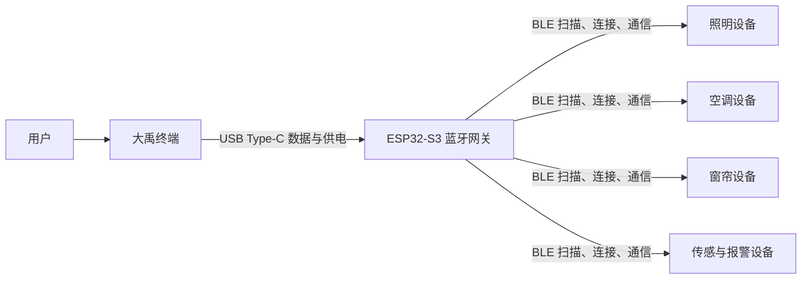

# 蓝牙网关阶段最终展示方案

## 1. 展示目标

本阶段要展示的是：大禹通过 USB Type-C 连接 ESP32-S3 网关，网关再通过 BLE 与家居设备通信。大禹负责界面、指令组织、状态展示和用户交互；ESP32-S3 网关负责 BLE 扫描、连接、数据转发和设备侧通信。

最终展示不应让用户感受到复杂的串口、端点或协议细节。用户看到的是“接入蓝牙网关”和“蓝牙设备已连接”等清晰状态，技术日志只在调试信息窗口中提供给联调人员查看。

## 2. 最终系统结构



大禹与网关之间使用 USB 传输控制帧和状态帧。网关与各设备之间使用 BLE。USB 测试阶段复用已有 USB 配网通道的设备枚举、连接、读写能力，但不执行 Wi-Fi 配网流程，也不把蓝牙测试称为串口配网。

## 3. 大禹界面最终形态

### 3.1 入口位置

蓝牙网关功能放在“大禹设备输出”调试窗口的底部，作为当前阶段的联调入口。正式展示时可以将标题显示为：

```text
蓝牙网关
```

调试人员需要查看底层帧时，再打开“大禹设备输出”日志区域。普通用户不需要看到 `0x60`、`0x61`、CRC 或 USB interface 等技术字段。

### 3.2 网关测试区域

区域内显示以下内容：

```text
蓝牙网关
状态：等待检测 USB 网关
设备：未连接
最近响应：尚未测试
```

按钮保持三个核心操作：

| 按钮 | 作用 |
| --- | --- |
| 刷新设备 | 重新枚举当前连接的大禹 USB 设备，寻找 ESP32-S3 网关 |
| 连接 | 连接选中的网关数据接口；连接后按钮变为断开 |
| 发送测试帧 | 向已连接网关发送一次测试帧并等待 ACK |

按钮状态应符合以下规则：

- 没有发现网关时，连接和发送测试帧不可用；
- 未连接网关时，发送测试帧不可用；
- 等待 ACK 时，发送测试帧不可重复点击；
- 断开后清理当前连接、待读取数据和超时计时器；
- 切换页面不会重复创建 USB 读取任务或重复刷新设备列表。

### 3.3 成功状态

收到正确 ACK 后，界面显示：

```text
状态：蓝牙网关 USB 通道正常
设备：ESP32-S3 网关已连接
最近响应：测试成功 · 往返 xxx ms
```

正式接入 BLE 后，状态区可继续显示：

```text
蓝牙状态：已就绪
已连接设备：N 台
最近同步：刚刚
```

网关名称、连接数量和设备名称应来自网关上报的数据，不在大禹端写死。

### 3.4 失败状态

不同故障显示不同的用户可读信息：

| 情况 | 界面提示 |
| --- | --- |
| 未插入 USB | 未发现蓝牙网关，请连接设备 |
| 未授权 | 请允许大禹访问 USB 设备 |
| 连接失败 | 蓝牙网关连接失败，请重新连接 |
| ACK 超时 | 网关未响应，请检查 USB 数据线和固件 |
| ACK 校验失败 | 网关响应异常，请重新测试 |
| BLE 未就绪 | USB 通道正常，蓝牙设备尚未就绪 |

错误详情写入调试日志，不直接堆在普通用户界面上。

## 4. 现场展示流程

### 4.1 第一阶段：USB 联通验证

```text
ESP32-S3 网关上电
    ↓
使用 USB Type-C 数据线连接大禹
    ↓
点击“刷新设备”
    ↓
大禹枚举出 ESP32-S3 网关
    ↓
点击“连接”
    ↓
点击“发送测试帧”
    ↓
网关收到 0x60 并校验 CRC
    ↓
网关返回 0x61 ACK
    ↓
大禹显示“蓝牙网关 USB 通道正常”
```

这一阶段只证明 USB 收发链路正常，不证明 BLE 扫描或家居设备控制已经完成。

### 4.2 第二阶段：BLE 网关工作验证

USB 测试成功后，进入网关工作状态：

```text
大禹发送启动或扫描指令
    ↓
ESP32-S3 网关启动 BLE 扫描
    ↓
网关发现附近已配置设备
    ↓
网关建立 BLE 连接并上报设备信息
    ↓
大禹显示已发现设备和设备能力
    ↓
用户从总览页执行灯光、空调、窗帘或报警相关操作
    ↓
大禹通过 USB 将控制指令交给网关
    ↓
网关通过 BLE 转发给目标设备
    ↓
目标设备执行并返回状态
    ↓
网关通过 USB 上报 ACK 和最新状态
    ↓
大禹更新界面
```

### 4.3 最终演示顺序

建议现场按照下面顺序演示：

1. 展示 ESP32-S3 网关和 USB Type-C 连接；
2. 在大禹调试窗口刷新并连接网关；
3. 发送测试帧，展示 ACK 和往返耗时；
4. 启动 BLE 扫描，展示发现的设备数量；
5. 展示设备名称、类型和可用能力；
6. 执行一次开灯或关灯，展示指令执行结果；
7. 执行一次空调或窗帘操作，展示目标设备状态变化；
8. 拔掉 USB 或关闭网关，展示断开状态；
9. 重新连接后展示网关恢复和设备重新同步。

## 5. USB 测试帧的展示依据

USB 测试使用自定义二进制帧：

```text
AA 55 | version | type | seq | payload_len | payload | CRC16
```

当前测试请求类型为 `0x60`，网关 ACK 类型为 `0x61`。大禹发送测试请求后，ESP32-S3 必须原样返回请求序号，便于大禹判断这条 ACK 是否对应当前请求。

测试请求中的业务内容为：

```json
{
  "type": "gateway_test",
  "message": "dayu-usb-test",
  "timestamp": 0
}
```

ACK 示例：

```json
{
  "type": "gateway_test_ack",
  "ok": true,
  "message": "esp32-s3-gateway-ready",
  "seq": 1
}
```

USB 测试帧本身用于验证链路，不在此阶段叠加 AES-GCM、SM4-GCM 或 ECDH。正式业务数据是否加密、采用哪种算法，应由现有控制通道和网关业务协议确定；不能把测试帧是否加密作为 BLE 是否可用的判断依据。

## 6. 调试日志要求

调试窗口建议保留以下信息：

```text
[USB] config id=... interfaces=...
[USB] iface id=... class=... sub=... proto=... endpoints=...
[USB] bulk ep addr=... dir=...
[USB] selected dataIface=... ctrlIface=... in=... out=...
[TX] type=0x60 seq=1 ...
[RX][raw] 91B AA 55 01 61 01 00 52 ...
[RX] type=0x61 seq=1 crc=OK
```

ESP32-S3 的协议数据通道不能混入启动日志或普通文本。类似 `ESP32_S3_GATEWAY_READY` 的信息应输出到独立日志通道，否则可能影响大禹寻找 `AA 55` 帧头和解析 ACK。

## 7. 阶段验收标准

### USB 联通验收

- 大禹可以稳定枚举 ESP32-S3 网关；
- 选中的数据 interface 同时具有 Bulk IN 和 Bulk OUT；
- 大禹发送 `0x60` 后，网关能收到完整帧并通过 CRC；
- 网关返回 `0x61`，外层序号与请求一致；
- 大禹能显示 `ok=true` 和往返耗时；
- 连续测试 10 次，10 次都在 3 秒内收到对应 ACK；
- 不出现半帧、粘包、CRC 错误或 ACK 串序。

### BLE 网关验收

- 网关能够启动和停止 BLE 扫描；
- 网关能发现目标设备并上报设备标识；
- 大禹能显示设备名称、设备类型和能力；
- 控制指令能够经过 USB 和 BLE 到达目标设备；
- 目标设备执行结果能够返回大禹；
- 网关断开、重连后，设备列表和状态能够恢复；
- 一个网关可以管理多个 BLE 设备，设备之间的指令不能串路由。

## 8. 文档中应强调的边界

本阶段的“蓝牙网关”不是让大禹直接扫描或连接蓝牙，而是由 ESP32-S3 承担 BLE 无线侧工作。大禹只通过 USB 与网关通信。

USB 通信方式复用了已有串口配网模块的底层能力，但蓝牙网关测试拥有独立的 `0x60/0x61` 测试帧和独立的界面入口。它不等于重新执行设备配网，也不会改变现有 MQTT、HTTP、AES、SM4 或传感器业务逻辑。

