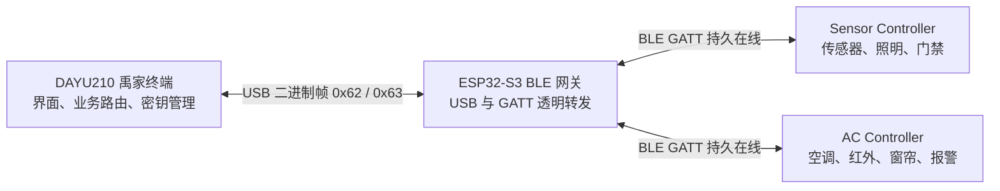
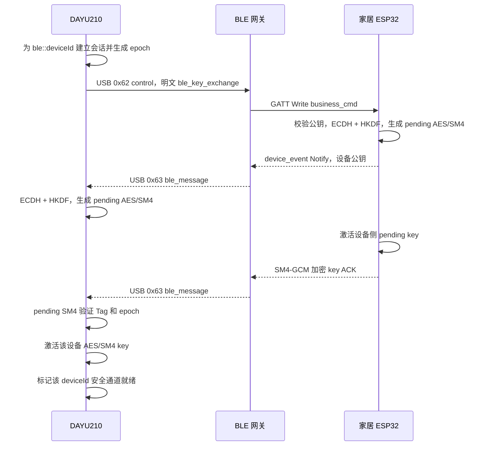

# 禹家蓝牙通信协议与安全机制详细设计

## 1. 文档目的

本文说明禹家终端当前蓝牙通信链路的实际实现，重点覆盖：

- DAYU210、ESP32-S3 蓝牙网关和两片家居 ESP32-S3 之间的通信关系；
- BLE GATT Service、Characteristic、Write 和 Notify 的使用方式；
- AES-256-GCM 与 SM4-GCM 两种业务数据层加密；
- P-256 ECDH、HKDF-SHA256 和动态会话密钥激活流程；
- 多设备独立会话、算法切换、ACK 和超时处理；
- BLE 传输层没有使用 TLS 的原因，以及它与 Wi-Fi 安全链路的关系；
- 当前实现能够提供的保护和仍然存在的安全边界。

本文以 2026 年 8 月 16 日工作区源码为准。协议事实以源码为最终依据，阶段交接文档只作为背景资料。

本文中的“认领设备”或“配网”是禹家业务状态，不等同于 Bluetooth SMP Pairing/Bonding。

## 2. 总体架构

DAYU210 当前不直接调用 OpenHarmony 蓝牙接口，而是通过 USB 连接一片 ESP32-S3 蓝牙网关。网关作为 BLE Central，同时连接两片作为 BLE Peripheral 的家居 ESP32-S3。



三类节点的职责如下。

### 2.1 DAYU210

- 管理设备列表、能力绑定和 `deviceId` 路由；
- 为每台 BLE 设备维护独立的 ECDH 状态、epoch、AES 密钥和 SM4 密钥；
- 加密业务 JSON，解析并认证设备返回的密文；
- 通过 USB 向网关发送扫描、连接、控制、认领和移除命令；
- 等待真正的设备业务 ACK，而不是把 GATT 写成功当成执行成功。

### 2.2 BLE 网关

- 作为 USB Device 与 DAYU210 通信；
- 作为 BLE Central 扫描、连接和维护多个 Peripheral；
- 发现 GATT Service 和 Characteristic，读取 `device_hello`，订阅 Notify；
- 按外层 `deviceId` 把数据写入指定设备的 `business_cmd`；
- 将 `device_event` Notify 原样转发给 DAYU210；
- 不持有业务动态密钥，不解密业务内容，也不保存 Wi-Fi 密码。

### 2.3 家居 ESP32-S3

- 广播禹家自定义 Service UUID；
- 提供设备身份、名称、能力和接入状态；
- 接收密钥协商消息和加密业务指令；
- 执行 ECDH、HKDF、AES-GCM 或 SM4-GCM；
- 执行灯光、门禁、空调、窗帘、报警、红外学习和配网等业务；
- 通过 Notify 返回加密 ACK、真实状态和周期传感器数据。

## 3. 通信分层

当前 BLE 链路可以分为五层：

| 层次 | 数据形式 | 责任节点 |
| --- | --- | --- |
| 业务层 | `{"cmd":"led","val":1,"seq":42}` 等 JSON | DAYU210、家居 ESP32 |
| 数据安全层 | AES-256-GCM 或 SM4-GCM，`IV | TAG | CIPHERTEXT` | DAYU210、家居 ESP32 |
| BLE 安全信封 | `ble_secure` JSON，包含算法、epoch 和 Base64 密文 | DAYU210、家居 ESP32 |
| GATT 层 | `business_cmd` Write、`device_event` Notify | BLE 网关、家居 ESP32 |
| DAYU 网关层 | USB `0x62` 命令和 `0x63` 事件 | DAYU210、BLE 网关 |

网关只处理路由层和 GATT 层。端到端业务加密发生在 DAYU210 与目标家居 ESP32 之间，因此即使网关能够看到 GATT 字节，也不能解出正常业务明文。

## 4. 设备身份与连接状态

### 4.1 稳定设备身份

家居设备使用稳定 `deviceId` 作为跨链路身份。BLE 与 Wi-Fi 使用同一个设备 ID，例如：

```text
esp32-744DBD8A253C   Sensor Controller
esp32-94A990D24D10   AC Controller
```

扫描初期网关可能只知道 BLE 地址，并临时把地址作为目标标识。读取 `device_hello` 后，DAYU210 按 BLE 地址把临时记录升级为稳定 `deviceId`，避免同一设备出现两条记录。

### 4.2 已发现不等于已连接

- 已发现：存在广播记录或网关 NVS 缓存，但未必存在可用 GATT 链路。
- 已连接：网关持有有效 connection handle，已完成 Service/Characteristic 发现，并已订阅 `device_event` Notify。
- 安全通道就绪：在已连接基础上，该设备的 BLE ECDH 已完成，动态 AES 和 SM4 密钥已经通过加密 ACK 验证并激活。

只有安全通道就绪后，DAYU210 才允许发送正常 BLE 业务命令或无线配网命令。

## 5. GATT 接口

BLE 网关与两片家居 Peripheral 固件对同一组 128-bit UUID 达成协议约定，其中 Service 由两片 Peripheral 注册，网关按这些 UUID 执行扫描过滤和 GATT 发现。

| 名称 | 标准 UUID | 属性 | 用途 |
| --- | --- | --- | --- |
| 禹家 Service | `7A6A0001-6B2D-4F01-9C6A-7E8B1A2C0001` | Primary Service | 广播过滤与设备识别 |
| `device_hello` | `7A6A0002-6B2D-4F01-9C6A-7E8B1A2C0001` | Read、Notify | 读取设备身份、能力和接入状态 |
| `business_cmd` | `7A6A0003-6B2D-4F01-9C6A-7E8B1A2C0001` | Write | DAYU210 到设备的握手和业务数据 |
| `device_event` | `7A6A0004-6B2D-4F01-9C6A-7E8B1A2C0001` | Notify | 设备到 DAYU210 的公钥、ACK、状态和传感数据 |

源码中的 `BLE_UUID128_INIT` 按 NimBLE 要求使用小端字节数组，日志和本文使用标准 UUID 字符串。不能把标准字符串的显示顺序直接照抄为 NimBLE 字节数组。

### 5.1 发现和连接顺序

```text
DAYU210 发送 scan-start
  -> 网关按 Service UUID 过滤广播
  -> 网关连接目标 Peripheral
  -> 交换 ATT MTU
  -> 发现禹家 Service
  -> 发现三个 Characteristic
  -> 读取 device_hello
  -> 订阅 device_event CCCD
  -> 上报 connected 和 ready
  -> DAYU210 对该 deviceId 发起 ECDH
```

只有广播匹配禹家 Service UUID 的设备才进入候选列表。手机、耳机等无关 BLE 设备不会作为禹家设备上报。

### 5.2 MTU 与单包限制

网关和 Peripheral 的首选 ATT MTU 为 256 字节。ATT Write/Notify 还需要 3 字节协议开销，因此理论有效载荷约为：

```text
256 - 3 = 253 bytes
```

项目没有把 253 字节全部用满，而是保留余量：

```text
BLE_BUSINESS_PLAINTEXT_MAX_BYTES = 120
BLE_GATT_PAYLOAD_MAX_BYTES       = 240
```

当前普通业务信封必须放入一次 GATT Write 或 Notify，不依赖 Long Write。超过 240 字节时 DAYU210 在发送前直接拒绝，Peripheral 在 Notify 前也会比较实际 `MTU - 3`。

之所以明文上限只有 120 字节，是因为数据还要经历：

```text
明文 N 字节
  -> GCM 增加 12B IV 和 16B Tag
  -> Base64 扩大到约原字节数的 4/3
  -> ble_secure JSON 再增加字段开销
```

对较大的 Wi-Fi 配置，项目在业务层使用 18 字节明文分片，而不是冒险发送接近 MTU 上限的大包。

## 6. DAYU 与网关之间的 BLE 转发

### 6.1 下行控制

DAYU210 把目标设备、逻辑 Topic 和待写入 GATT 的完整字节封装进 USB `0x62` 帧：

```json
{
  "type": "gateway_ble_command",
  "cmd": "ble",
  "action": "control",
  "seq": 27,
  "deviceId": "esp32-744DBD8A253C",
  "characteristic": "business_cmd",
  "topic": "dayu/cmd/esp32-744DBD8A253C",
  "crypto": "SM4",
  "bytes": 202,
  "responseBudget": 2,
  "payloadBase64": "..."
}
```

网关执行：

1. 按 `deviceId` 找到对应 connection handle 和 `business_cmd` handle；
2. Base64 解码 `payloadBase64`；
3. 将解码后的完整字节写入目标 Characteristic；
4. 返回 `ble_control_result`。

`ble_control_result.ok=true` 只表示网关成功提交了一次 GATT Write，不表示灯、门锁、空调或窗帘已经执行。业务成功必须继续等待 Peripheral 返回的加密 ACK。

### 6.2 上行事件

Peripheral 通过 `device_event` Notify 发出数据。网关把 Notify 字节完整复制到自己的队列，再封装为 USB `0x63` 事件：

```json
{
  "type": "ble_message",
  "seq": 31,
  "deviceId": "esp32-744DBD8A253C",
  "topic": "device/esp32-744DBD8A253C/status",
  "crypto": "none",
  "bytes": 218,
  "payloadBase64": "..."
}
```

这里的外层 `crypto:"none"` 只表示网关没有加解密。`payloadBase64` 解码后通常仍然是一个 `ble_secure` 加密信封，不能把它理解为业务明文。

网关上报的外层 `deviceId` 是多设备路由的权威信息。内层握手和业务包为了节省 GATT 空间，不必重复携带设备 ID。

### 6.3 业务 ACK

每条控制命令携带业务 `seq`。设备执行完成后返回相同 `seq` 的 ACK，例如：

```json
{"type":"ack","cmd":"led","ok":true,"val":1,"seq":42}
```

DAYU210 只有在以下条件同时满足时才确认成功：

- ACK 能通过当前设备动态密钥的 GCM Tag 验证；
- `deviceId` 与命令目标一致；
- `cmd`、`seq` 和必要的目标状态一致；
- ACK 表示 `ok=true`。

Notify 本身没有应用层重传保证，因此业务层保留超时、重试和周期真实状态回传。迟到 ACK 不能匹配新的命令。

## 7. 业务数据层加密

### 7.1 加密前的业务明文

业务明文是 UTF-8 JSON。不同功能复用同一安全通道，例如：

```json
{"cmd":"led","val":1,"seq":42}
```

```json
{"cmd":"door","val":0,"seq":43}
```

```json
{"cmd":"ac","power":true,"temp":26,"mode":"cool","seq":44}
```

业务执行逻辑不直接接触 GATT、Base64 或 USB 帧。它只接收通过认证的 JSON，并生成对应 ACK 或状态。

### 7.2 统一 GCM 二进制格式

AES-GCM 与 SM4-GCM 使用完全相同的线格式：

```text
offset  length  field
0       12      IV
12      16      authentication tag
28      N       ciphertext
```

即：

```text
Packet = IV(12B) || TAG(16B) || CIPHERTEXT(NB)
```

当前 AAD 为空。每次加密都生成新的 12 字节随机 IV。同一把 GCM 密钥下 IV 不得重复，否则会破坏 GCM 的安全性。

接收端必须先验证 Tag，再解析 UTF-8 和 JSON。Tag 不匹配、包长小于 28 字节、算法字段非法或 JSON 解析失败时，设备不得执行任何业务动作。

### 7.3 `ble_secure` 外层信封

GCM 二进制包经过 Base64 后放入 JSON：

```json
{
  "type": "ble_secure",
  "version": 1,
  "crypto": "SM4",
  "epoch": 1786369566,
  "payloadBase64": "..."
}
```

字段含义：

| 字段 | 含义 |
| --- | --- |
| `type` | 固定为 `ble_secure` |
| `version` | 当前协议版本为 1 |
| `crypto` | `AES` 或 `SM4`，决定选择哪一把动态密钥 |
| `epoch` | 当前 BLE 会话代次，用于过滤旧握手和迟到数据 |
| `payloadBase64` | `IV | TAG | CIPHERTEXT` 的 Base64 编码 |

`crypto` 和 `epoch` 当前位于密文外，且未放入 GCM AAD。它们用于状态机选择和过滤，但不应被描述为已经由 AAD 绑定的认证元数据。

## 8. AES 与 SM4 两种加密方式

| 项目 | AES 模式 | SM4 模式 |
| --- | --- | --- |
| 算法 | AES-256-GCM | SM4-GCM |
| 动态密钥长度 | 32 字节 | 16 字节 |
| IV | 12 字节随机值 | 12 字节随机值 |
| Tag | 16 字节 | 16 字节 |
| AAD | 当前为空 | 当前为空 |
| DAYU210 实现 | OpenHarmony `cryptoFramework` | 项目 `Sm4Gcm.ets` |
| ESP32 实现 | 项目 AES-GCM 适配层 | 项目 SM4-GCM 适配层 |

两种模式都属于 AEAD，能够同时提供：

- 机密性：没有会话密钥无法恢复业务明文；
- 完整性：密文或 Tag 被修改后认证失败；
- 持钥确认：能够生成有效 Tag 的一方必须持有对应会话密钥。

项目默认使用 SM4-GCM。选择 AES 或 SM4 不会重新执行 ECDH，因为一次密钥协商会同时派生两把密钥。

### 8.1 加密模式切换

蓝牙业务模式切换不是只改 DAYU210 本地变量。当前流程为：

1. 确认两片家居设备均在线且动态密钥就绪；
2. 使用切换前的当前模式，分别向两片设备发送 `crypto` 命令；
3. 每片设备切换密钥选择，并使用目标模式返回加密 ACK；
4. DAYU210 收齐两片设备相同 `seq` 和目标模式的 ACK；
5. 两片都确认后，界面和全局 BLE 业务模式才正式更新。

因此 AES/SM4 切换是多设备确认事务。任一设备未确认时，DAYU210 不应显示全局切换成功。

## 9. BLE 动态密钥协商

### 9.1 目标

动态密钥协商需要满足：

- 私钥不通过 USB、BLE 或网络传输；
- Sensor 与 AC 使用不同会话密钥；
- BLE 与 Wi-Fi 的业务密钥相互隔离；
- AES 和 SM4 使用独立派生结果；
- 新密钥必须经过设备加密确认后才能成为 active key；
- 旧连接留下的公钥、ACK 和密文不能误激活新会话。

### 9.2 P-256 公钥格式

双方使用 P-256，也称 `secp256r1` 或 `prime256v1`。公钥采用 65 字节非压缩格式：

```text
0x04 || X(32B, big-endian) || Y(32B, big-endian)
```

DAYU210 在发送前检查：

- 长度必须为 65 字节；
- 首字节必须为 `0x04`；
- `X`、`Y` 必须落在 P-256 曲线上；
- 公钥经过 Base64 编码再解码后必须逐字节不变。

### 9.3 与 Wi-Fi 密钥协商的关系

BLE 的 ECDH 思路与 Wi-Fi 类似，但会话和业务密钥不能混用。

当前实现为了规避 ESP-IDF、mbedTLS 和 PSA Crypto 对第二套 P-256 私钥的兼容问题，同一目标设备的 Wi-Fi 会话与 BLE 会话复用本机 P-256 密钥对。DAYU210 会显式校验两条链路的本地公钥一致。

复用 P-256 密钥对不代表复用业务密钥。DAYU210 为 BLE 使用独立会话 ID：

```text
Wi-Fi session: <deviceId>
BLE session:   ble::<deviceId>
```

两条链路分别保存对端公钥、pending key、active key 和 epoch，并通过 HKDF `info` 做域隔离。

### 9.4 ECDH 与 HKDF

设 DAYU210 私钥、公钥为 `d_D`、`Q_D`，ESP32 私钥、公钥为 `d_E`、`Q_E`：

```text
Z_D = ECDH(d_D, Q_E)
Z_E = ECDH(d_E, Q_D)
Z_D = Z_E = Z
```

ECDH 共享秘密统一归一化为 32 字节，然后输入 HKDF-SHA256。HKDF 使用与 Wi-Fi 相同的固定 16 字节 salt，但使用 BLE 专属 `info`：

```text
K_ble_aes = HKDF-SHA256(
  ikm=Z,
  salt=fixed_16_bytes,
  info="ble-aes-key",
  length=32
)

K_ble_sm4 = HKDF-SHA256(
  ikm=Z,
  salt=fixed_16_bytes,
  info="ble-sm4-key",
  length=16
)
```

Wi-Fi 使用 `aes-key` 和 `sm4-key`，BLE 使用 `ble-aes-key` 和 `ble-sm4-key`。不同 `info` 让两条链路即使得到相同 ECDH 共享秘密，也会产生不同的业务密钥。

不能用 AES 密钥的前 16 字节充当 SM4 密钥，也不能把 Wi-Fi 密钥复制到 BLE 密钥槽。

### 9.5 握手报文

DAYU210 先通过 `business_cmd` 明文发送自己的公钥：

```json
{
  "type": "ble_key_exchange",
  "action": "public-key",
  "epoch": 1786369566,
  "publicKeyBase64": "65字节非压缩P-256公钥的Base64"
}
```

ESP32 完成 ECDH 和 HKDF 后，通过 `device_event` 明文返回自己的公钥：

```json
{
  "type": "ble_key_exchange",
  "action": "public-key",
  "epoch": 1786369566,
  "publicKeyBase64": "..."
}
```

设备随后使用新派生的 BLE SM4 pending key 加密确认明文：

```json
{"type":"ack","cmd":"key","ok":true,"epoch":1786369566}
```

确认消息最终以 `ble_secure` 信封通过 Notify 返回。

### 9.6 Pending Key 两阶段激活

双方不能在仅收到公钥时就直接宣告安全通道就绪。否则一方已经切换新密钥、另一方仍使用旧状态时，第一条业务消息就会失联。

当前采用两阶段激活：

```text
收到对端公钥
  -> 计算 ECDH shared secret
  -> 派生 pending AES 和 pending SM4
  -> 暂不把 pending key 暴露给普通业务
  -> 等待新密钥保护的 key ACK
  -> 使用 pending key 验证 GCM Tag
  -> 验证成功后 pending -> active
```

DAYU210 当前还允许第一条能被 pending key 成功认证并解析为非空 JSON 的设备消息完成激活。这用于专用 key ACK 丢失、但设备已经开始使用新密钥发送状态的恢复场景。核心判据仍然是 pending key 下的 GCM 认证成功，而不是仅收到某个明文字段。

### 9.7 完整握手时序



### 9.8 Epoch、超时与断线恢复

DAYU210 使用接近当前时间且对该设备单调增加的整数作为 epoch。它用于区分不同轮次，降低旧 USB/BLE 队列数据误匹配新协商的风险。

当前关键行为：

- 公钥回复和 pending key ACK 的 epoch 必须与当前目标匹配；
- 单台设备协商等待约 15 秒，失败后有限次数自动重试；
- 每台设备独立记录重试数、认证失败数和接收队列；
- BLE 断开时清除该链路 active/pending 状态；
- GATT 重连后重新发起 BLE ECDH，不把旧 BLE 会话直接当作仍然有效；
- Sensor 和 AC 逐台完成协商，前一台 ready 后继续下一台。

Epoch 当前主要是状态机代次，不是完整的密码学重放保护，因为它未进入 GCM AAD。敏感命令仍应依靠业务 `seq`、设备端去重和后续协议增强。

## 10. 多设备并行控制

BLE 网关为每台已连接设备分别保存：

```text
BLE address
deviceId
connection handle
business_cmd value handle
device_event value handle
Notify subscription state
capabilities
```

DAYU210 也按设备维护：

```text
ble::<deviceId> ECDH session
AES dynamic key
SM4 dynamic key
epoch
ready state
retry and authentication-failure counters
receive Promise chain
pending business seq
```

因此两片家居 ESP32 可以同时保持 GATT 连接，并分别接收控制和返回周期状态。密钥协商动作目前按设备顺序执行，避免握手 Notify 与高频传感上报竞争；协商完成后的业务收发按设备路由，互不共用 ready 标志或动态密钥。

增加更多设备时，协议结构不需要改变，但必须同时评估 NimBLE 最大连接数、内存、连接间隔、2.4 GHz 共存和 Notify 队列容量。

## 11. 为什么 BLE 没有使用 TLS

### 11.1 TLS 与 GATT 不在同一接口层

TLS 1.2/1.3 通常运行在可靠、有序的字节流之上，例如 TCP；DTLS 则面向不可靠数据报。当前 BLE 业务使用的是 ATT/GATT：

- 下行是对 Characteristic 的 Write；
- 上行是 Characteristic Notify；
- 数据天然按属性操作和消息边界组织；
- 单次有效载荷受 ATT MTU 限制；
- 链路上不存在一个可直接交给 TLS 库的 TCP Socket。

理论上可以在 GATT 上自行实现 TLS Record 分片、重组、顺序控制和握手承载，但那将是一层额外隧道，不是 BLE 原生 TLS。

### 11.2 当前场景下 TLS 隧道代价较大

在约 240 字节的项目载荷预算下，TLS 隧道会带来：

- 多轮握手和证书传输；
- TLS Record、证书链和握手状态机的额外字节；
- 大量 GATT 分片、重组和超时恢复；
- ESP32 RAM、Flash 和 CPU 消耗；
- 连接建立延迟增加；
- 与现有按消息 ACK 的业务状态机重复。

当前方案直接使用 P-256 ECDH + HKDF 建立设备级密钥，再用 GCM 对每条业务消息做 AEAD，能够以较小开销保护真正需要保密和认证的业务数据。

### 11.3 “没有 TLS”不等于“BLE 自动安全”

项目不能用“BLE 距离近”或“蓝牙本身会加密”来代替安全说明。当前源码没有把业务安全建立在 BLE SMP 配对、Passkey 或 Bonding 上，正常业务保护来自项目自己的 ECDH 和 GCM 数据层。

因此当前实际情况是：

- 广播、Service UUID、BLE 地址和设备名称可被附近扫描者观察；
- `device_hello` 和初次 ECDH 公钥交换是明文；
- ECDH 完成后的业务 JSON、ACK、状态和无线配网内容使用 GCM 加密；
- 网关只看到路由元数据、外层信封和密文；
- 没有 TLS 证书链为初始 ECDH 公钥提供身份认证。

换言之，当前方案解决了业务数据机密性和完整性，但不能自动获得 TLS 证书认证、握手 transcript 认证等全部属性。

### 11.4 BLE Link Layer Encryption 是另一回事

BLE SMP/LE Secure Connections 可以在 Bluetooth Link Layer 建立加密和 Bonding，它与 TLS、项目 GCM 都是不同层次。后续可以在现有协议外再启用 SMP 作为链路加固，但不能因此删除端到端业务加密，因为：

- 外置网关位于链路端点，链路层密文会在网关处解开；
- 业务层 GCM 仍可保证 DAYU210 到目标家居设备的端到端保护；
- Wi-Fi 与 BLE 需要保持相同的业务安全语义。

## 12. 与 Wi-Fi 通信的关系

BLE 复用了 Wi-Fi 已有的业务安全思路，重复部分只做简要对比。

| 项目 | BLE | Wi-Fi MQTT/HTTP |
| --- | --- | --- |
| 业务 JSON 和 ACK | 基本相同 | 基本相同 |
| 数据层算法 | AES-256-GCM / SM4-GCM | AES-256-GCM / SM4-GCM |
| 动态协商 | P-256 ECDH + HKDF-SHA256 | P-256 ECDH + HKDF-SHA256 |
| 设备隔离 | `ble::<deviceId>` | `<deviceId>` |
| HKDF info | `ble-aes-key`、`ble-sm4-key` | `aes-key`、`sm4-key` |
| 传输 | USB 网关 + GATT | MQTT/MQTTS 或 HTTP/HTTPS |
| TLS | 不在 GATT 上建立 TLS | MQTTS/HTTPS/WSS 可使用 TLS |
| 中间节点 | BLE 网关透明转发 | Broker/HTTP Bridge 路由 |
| 包长约束 | 240B 项目上限，必要时业务分片 | 网络载荷空间更充足 |

Wi-Fi 中 TLS 与 AES/SM4-GCM 是两层独立保护：TLS 保护网络连接、服务身份和传输元数据，GCM 保护业务载荷。BLE 没有套 TLS，因此 BLE 的安全结论必须以自定义 ECDH/GCM 能覆盖的范围为准。

MQTT 和 HTTP 可以共享同一套 Wi-Fi 设备会话密钥；BLE 必须使用独立密钥槽，不能因为业务 JSON 相同就复用 Wi-Fi 密钥。

## 13. BLE 无线配网与设备移除

无线配网和设备移除复用同一条 BLE 动态密钥安全通道，不会把 Wi-Fi 密码直接作为明文 GATT 数据发送。

完整配置包含 SSID、密码、Broker URL、HTTP Bridge、目标 `deviceId`、Wi-Fi 控制协议和加密算法。由于完整配置超过单包预算，当前使用：

```text
最大配置       2048 bytes
每个明文分片   18 bytes
完整性校验     CRC32
```

配网事务由以下动作组成：

| 动作 | 代码 | 用途 |
| --- | --- | --- |
| Begin | `a="b"` | 声明会话 ID、总字节数、分片数和 CRC32 |
| Chunk | `a="k"` | 按顺序发送 18B 配置分片 |
| Commit | `a="c"` | 校验完整配置、写入 NVS、ACK 后重启 |
| Remove | `a="r"` | 清除设备配网 NVS、ACK 后重启 |

每个动作和每个分片都先作为业务 JSON，再经过 AES/SM4-GCM 和 `ble_secure` 包装。设备返回匹配 `seq`、会话和分片索引的加密 ACK 后，DAYU210 才进入下一步。

配网成功后，DAYU210 再要求网关 `claim`；移除成功后，再要求网关 `forget`。这两个网关动作管理网关本地设备记录，不代替 Peripheral 自己清除或保存配置。

## 14. 当前安全边界与改进建议

### 14.1 初次公钥没有身份认证

当前 ECDH 公钥以明文交换，没有证书、数字签名或预共享密钥 MAC。主动攻击者若能同时拦截和修改 GATT 双向数据，理论上可以实施中间人攻击。

生产化建议至少选择一种认证方式：

- 出厂每设备唯一引导密钥，对 `deviceId | publicKey | epoch | nonce` 计算 HMAC；
- 设备证书或 Ed25519/ECDSA 身份签名；
- 扫码录入设备公钥指纹或一次性配对码；
- BLE LE Secure Connections + 数字比较/Passkey，并继续保留业务层 GCM。

### 14.2 AAD 为空

当前 GCM 没有认证外层 `deviceId`、Topic、算法、epoch 和业务 seq。后续建议定义版本化 AAD：

```text
AAD = protocolVersion || deviceId || topic || crypto || epoch || seq
```

这样可以把路由和会话元数据与密文绑定。

### 14.3 缺少统一重放窗口

随机 IV 和业务 seq 能降低重复执行风险，但当前密钥层没有统一维护 `epoch + seq` 接收窗口。门锁、撤销报警和配网等敏感命令应在设备端持久或半持久去重。

### 14.4 密钥和日志

- Base64 只是编码，不是加密；
- 动态密钥不应输出到发布日志；
- 当前联调源码仍存在共享秘密和派生密钥的调试日志，发布构建必须移除；
- DAYU210 正式版本应使用 HUKS 或等价安全密钥存储；
- 文档、截图、Git 提交和测试报告不得记录实际会话密钥、私钥或 Wi-Fi 密码。

### 14.5 随机 IV

GCM 安全依赖同一密钥下 IV 不重复。当前 DAYU210 使用系统安全随机源，ESP32 使用 `esp_random()` 生成 12 字节 IV。后续若加入密钥持久化和超长会话，应评估随机源状态、启动早期熵和 IV 冲突监测。

## 15. 故障定位顺序

出现“写入成功但设备无响应”时，建议按层定位：

1. USB：`0x62` 是否发送成功，`0x63` 是否持续接收；
2. 路由：外层 `deviceId` 是否对应正确 connection handle；
3. GATT：`business_cmd` handle、Notify CCCD 和实际 MTU 是否有效；
4. 握手：双方公钥是否都是 65B，epoch 是否一致；
5. 派生：HKDF salt、`ble-aes-key`、`ble-sm4-key` 和密钥长度是否一致；
6. 信封：`crypto`、`epoch`、Base64 和 `IV | TAG | CT` 是否完整；
7. 认证：GCM Tag 是否验证成功；
8. 业务：JSON、`cmd`、`seq`、目标能力和参数是否合法；
9. 回传：设备是否生成 ACK，Notify 是否超出 `MTU - 3`，网关是否完整复制；
10. 状态：DAYU210 是否收到真正业务 ACK，而不是只收到 `ble_control_result`。

多设备问题必须同时记录 `deviceId + epoch + seq + 时间顺序`。只看“BLE 已连接”无法判断错误属于哪一台设备或哪一层。

## 16. 关键代码位置

| 模块 | 代码位置 |
| --- | --- |
| DAYU BLE 状态机、路由、握手和业务收发 | `entry/src/main/ets/pages/Index.ets` |
| P-256、ECDH、HKDF 和 pending key | `entry/src/main/ets/crypto/KeyExchangeLayer.ets` |
| AES-GCM、SM4-GCM 和设备动态密钥表 | `entry/src/main/ets/crypto/CryptoLayer.ets` |
| DAYU SM4-GCM 实现 | `entry/src/main/ets/crypto/Sm4Gcm.ets` |
| USB 二进制帧和串行端口 | `entry/src/main/ets/provisioning/SerialProvisioningProtocol.ets`、`UsbSerialProvisioningPort.ets` |
| BLE 网关 Central、GATT 转发和多连接 | `esp32-ble-gateway/main/main.c` |
| Sensor GATT Peripheral | `esp32-ble-sensor/main/ble_peripheral.c` |
| Sensor BLE ECDH 与 GCM | `esp32-ble-sensor/main/ble_crypto.c` |
| Sensor BLE 业务协议 | `esp32-ble-sensor/main/ble_bridge.c` |
| AC GATT Peripheral | `esp32-ac-controller/main/ble_peripheral.c` |
| AC BLE ECDH 与 GCM | `esp32-ac-controller/main/ble_crypto.c` |
| AC、窗帘、报警、红外 BLE 业务 | `esp32-ac-controller/main/ble_bridge.c` |

其中 `entry/...` 位于 `YuHome_terminal` 仓库，`esp32-...` 位于 `esp32-software-cup` 仓库。

## 17. 总结

禹家 BLE 通信的核心不是“给 GATT 套一层 TLS”，而是：

```text
DAYU210 通过 USB 控制外置 BLE Central
  -> Central 按 deviceId 路由 GATT Write/Notify
  -> DAYU210 与每台 Peripheral 单独执行 P-256 ECDH
  -> HKDF-SHA256 同时派生 BLE AES 和 SM4 动态密钥
  -> pending key 通过加密 ACK 验证后激活
  -> 每条业务 JSON 使用 AES-256-GCM 或 SM4-GCM
  -> 设备真实 ACK 和周期状态沿相同安全通道返回
```

它与 Wi-Fi 链路共用业务模型和密码算法思路，但使用独立会话 ID、HKDF 域和动态密钥。Wi-Fi 可以在 MQTT/HTTP 外再使用 TLS；BLE GATT 没有建立 TLS，而是依靠设备级 ECDH 和逐消息 GCM 保护业务数据。当前方案适合本项目的本地、多设备和小载荷控制场景，但正式部署前仍应补齐初始公钥身份认证、AAD、重放窗口、安全密钥存储和敏感日志清理。
