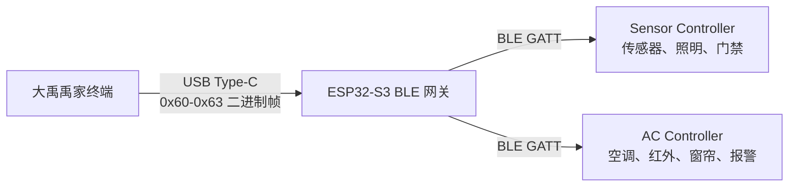
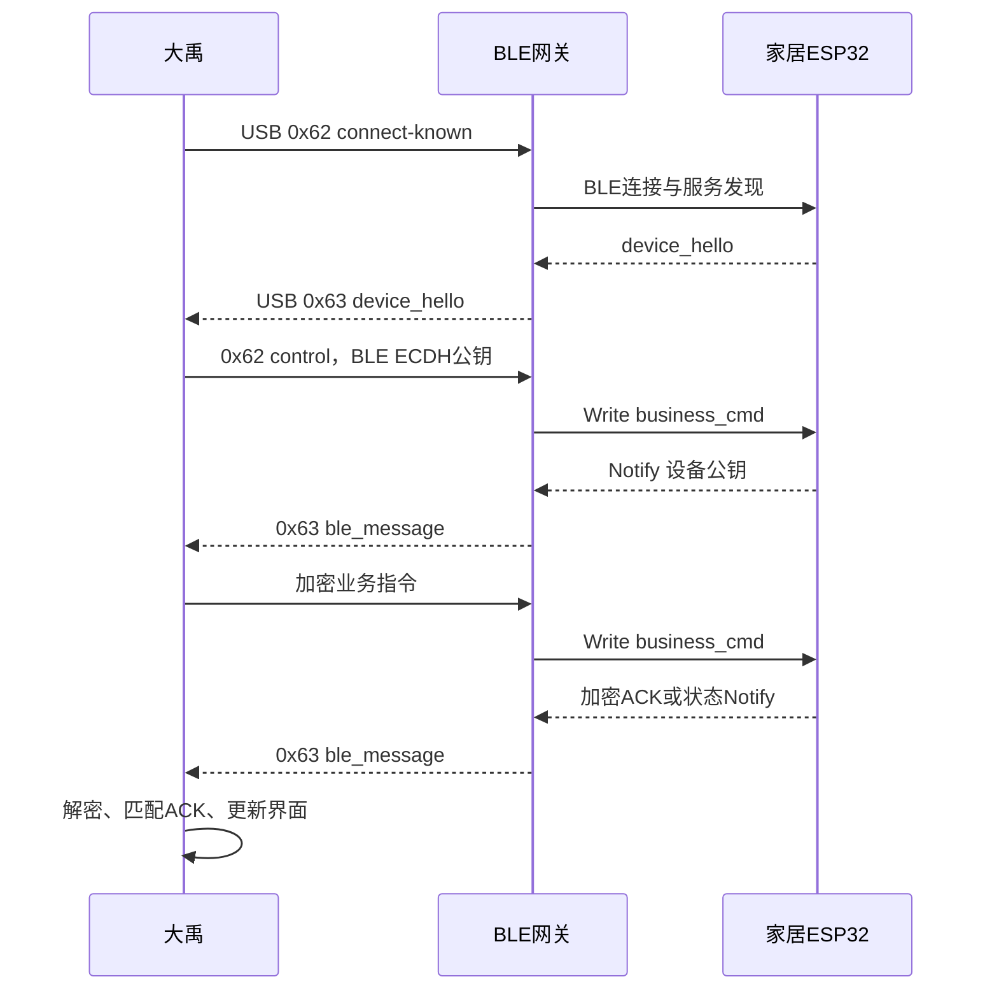

# 禹家蓝牙通信实现思路与开发状态

## 1. 文档说明

本文整理禹家终端蓝牙通信部分的总体设计、当前实现、协议约定、联调结论和后续工作。文档以 2026 年 8 月 9 日的代码与联调状态为准。

本文中的“已实现”表示对应代码或固件已经具备该能力；“已验证”表示该能力已经完成端到端实机测试。两者不能混为一谈。

## 2. 建设目标

蓝牙方案用于在没有 MQTT 或 HTTP 网络链路时，让大禹仍可与多片家居 ESP32-S3 通信。目标包括：

- 大禹通过一片 ESP32-S3 蓝牙网关管理多片家居 ESP32-S3；
- 首次发现设备后保存设备身份，以后自动恢复连接；
- 按 `deviceId` 和 `capabilities` 将命令路由到正确设备；
- 支持照明、空调、窗帘、门禁、报警和传感器等业务；
- 支持 AES-GCM 与 SM4-GCM，并使用独立于 Wi-Fi 的动态密钥；
- 蓝牙故障时在调试界面明确报错，不在当前测试阶段自动降级到 MQTT 或 HTTP。

## 3. 总体架构

大禹当前不直接调用 OpenHarmony 系统蓝牙接口，而是使用外置 ESP32-S3 作为 BLE Central 网关。



三类节点的职责如下。

### 3.1 大禹

- 枚举并打开 USB 蓝牙网关；
- 发送 USB 链路测试、扫描、重连和业务控制命令；
- 保存并展示家居设备列表；
- 根据 `deviceId` 和能力选择目标设备；
- 管理每台 BLE 设备独立的 ECDH 会话、AES 密钥、SM4 密钥和 epoch；
- 加密业务明文并解密设备事件；
- 维护命令等待、ACK 匹配、超时和界面状态。

### 3.2 ESP32-S3 蓝牙网关

- 通过 USB CDC 与大禹通信；
- 作为 BLE Central 扫描、连接并维护家居设备；
- 读取 `device_hello`；
- 将大禹的业务载荷写入目标设备的 `business_cmd`；
- 订阅目标设备的 `device_event` Notify；
- 将设备事件透明转发给大禹；
- 保存已知设备地址，支持 `connect-known` 自动恢复；
- 不持有业务动态密钥，不进行业务加解密。

### 3.3 家居 ESP32-S3

- 作为 BLE Peripheral 广播禹家 Service UUID；
- 提供设备身份、名称和能力；
- 接收 `business_cmd`；
- 执行 ECDH/HKDF、AES-GCM、SM4-GCM 和业务指令；
- 通过 `device_event` Notify 返回 ACK、状态或传感数据；
- BLE 密钥状态与 Wi-Fi/MQTT/HTTP 密钥状态相互独立。

## 4. USB 通信层

蓝牙网关复用了串口配网模块已经验证过的 USB 枚举、端点选择和 Bulk 收发能力，但蓝牙通信不是串口配网流程。两者只共用底层 USB 通道。

### 4.1 USB 帧格式

```text
AA 55 | version | type | seq | payload_len_hi | payload_len_lo | payload | crc_lo | crc_hi
```

- `version`：`0x01`；
- `payload_len`：大端序；
- `payload`：UTF-8 JSON 或测试载荷；
- CRC：CRC16-MODBUS，低字节在前；
- CRC 范围：从 `version` 到 `payload`，不包括 `AA 55` 和 CRC 自身。

### 4.2 帧类型

| 帧类型 | 方向 | 用途 | 当前状态 |
| --- | --- | --- | --- |
| `0x60` | 大禹到网关 | USB 测试帧 | 已实现并验证 |
| `0x61` | 网关到大禹 | USB 测试 ACK | 已实现并验证 |
| `0x62` | 大禹到网关 | BLE 扫描、重连、控制 | 已实现 |
| `0x63` | 网关到大禹 | BLE 设备、状态和业务事件 | 已实现 |

大禹 USB 接收端已将 IN 端点重新提交放到当前数据解析之前，降低网关连续上报多帧时的接收空窗。网关侧使用 FreeRTOS 队列串行发送，并等待前一帧发送完成，避免 USB 缓冲区被后续事件覆盖。

## 5. BLE GATT 定义

三片 ESP32 固件使用同一组 UUID。代码中 UUID 按 NimBLE 要求使用小端字节序注册，日志和协议文档使用标准 UUID 表示。

| 名称 | UUID | 属性 | 用途 |
| --- | --- | --- | --- |
| 禹家 Service | `7A6A0001-6B2D-4F01-9C6A-7E8B1A2C0001` | Primary Service | 识别禹家设备 |
| `device_hello` | `7A6A0002-6B2D-4F01-9C6A-7E8B1A2C0001` | Read | 读取设备身份和能力 |
| `business_cmd` | `7A6A0003-6B2D-4F01-9C6A-7E8B1A2C0001` | Write | 大禹到设备的业务数据 |
| `device_event` | `7A6A0004-6B2D-4F01-9C6A-7E8B1A2C0001` | Notify | 设备到大禹的事件和 ACK |

## 6. 设备发现与自动恢复

### 6.1 首次扫描

大禹通过 USB `0x62` 发送：

```json
{
  "type": "gateway_ble_command",
  "cmd": "ble",
  "action": "scan-start",
  "seq": 3,
  "durationMs": 25000,
  "maxDevices": 8,
  "autoConnect": true
}
```

网关按禹家 Service UUID 过滤周边广播，只上报家居设备。扫描到设备后，网关顺序连接、发现 GATT 服务、读取 `device_hello`，再上报设备详情。

### 6.2 设备身份

家居设备使用 Wi-Fi STA MAC 派生唯一 `deviceId`，BLE 与 MQTT/HTTP 使用相同设备身份。例如：

- Sensor Controller：`esp32-744DBD8A253C`；
- AC Controller：`esp32-94A990D24D10`。

当前能力示例：

```json
{
  "type": "device_hello",
  "deviceId": "esp32-744DBD8A253C",
  "name": "Sensor Controller",
  "capabilities": ["sensor", "door", "light"],
  "transport": "ble"
}
```

```json
{
  "type": "device_hello",
  "deviceId": "esp32-94A990D24D10",
  "name": "AC Controller",
  "capabilities": ["ac", "ir_learning", "curtain", "alarm"],
  "transport": "ble"
}
```

大禹按 BLE 地址和 `deviceId` 去重合并。单轮扫描未重新发现某台设备时，不清空以前已经验证过的记录。

### 6.3 自动恢复

首次扫描成功后，网关将已知设备保存到 NVS，大禹也持久化网关身份和设备记录。以后应用启动或 USB 网关重连时，大禹自动发送：

```json
{
  "type": "gateway_ble_command",
  "cmd": "ble",
  "action": "connect-known",
  "seq": 9
}
```

网关依次恢复已知设备，重新上报 `device_hello`、`ble_device_state` 和最终的 `ble_reconnect_finished`。若网关没有已知设备，大禹再自动转入扫描。

扫描界面主要用于首次接入、增加设备和故障恢复，不应成为日常控制前的必经步骤。

## 7. BLE 业务转发

### 7.1 大禹发送控制

大禹通过 USB `0x62` 将目标设备和 GATT 特征写入要求发送给网关：

```json
{
  "type": "gateway_ble_command",
  "cmd": "ble",
  "action": "control",
  "seq": 11,
  "deviceId": "esp32-744DBD8A253C",
  "characteristic": "business_cmd",
  "topic": "device/esp32-744DBD8A253C/cmd",
  "crypto": "none",
  "bytes": 83,
  "payloadBase64": "..."
}
```

网关对 `payloadBase64` 解码，将得到的字节写入目标设备的 `business_cmd`，随后返回 `ble_control_result`。该结果只表示 GATT 写入成功，不代表设备已经执行成功。

### 7.2 设备返回事件

设备通过 `device_event` Notify 返回数据。网关将 Notify 原始字节 Base64 编码后，通过 USB `0x63` 上报：

```json
{
  "type": "ble_message",
  "deviceId": "esp32-744DBD8A253C",
  "topic": "device/esp32-744DBD8A253C/status",
  "crypto": "none",
  "payloadBase64": "..."
}
```

只有解出并匹配设备业务 ACK 后，大禹才将控制状态改为执行成功。`ble_control_result` 不能提前代替设备 ACK。

### 7.3 已验证的明文灯控

明文阶段已经验证以下闭环：

```text
蓝牙调试页开灯
  -> 大禹发送 0x62 control
  -> 网关写入 Sensor business_cmd
  -> Sensor 执行 GPIO21 开灯
  -> Sensor 通过 device_event 返回 ACK
  -> 网关封装 ble_message 并通过 0x63 上报
  -> 大禹匹配 ACK 并更新灯光状态
```

开灯和关灯均使用同一个切换按钮。当前早期 Sensor 固件曾在 ACK 中固定返回 `seq=0`，大禹为单条在途调试命令保留了按 `deviceId` 匹配的兼容处理。正式协议应原样返回请求 `seq`，再移除该兼容逻辑。

## 8. BLE 独立动态密钥

### 8.1 设计原则

BLE 参照 Wi-Fi 已有算法实现动态密钥协商，但不复用 Wi-Fi 会话和密钥。每台设备分别维护：

- 与 Wi-Fi 共用的本地 P-256 密钥对；
- BLE 独立的对端公钥和 ECDH 会话状态；
- BLE epoch；
- BLE AES-256-GCM 动态密钥；
- BLE SM4-GCM 动态密钥；
- pending key 和 active key 状态。

受 ESP-IDF v6.0.1、mbedtls 4.x 和 PSA Crypto 对第二个 P-256 密钥对的兼容性限制，当前方案改为：同一设备的 Wi-Fi 与 BLE 共用本地 P-256 密钥对。大禹内部仍使用 `ble::<deviceId>` 作为 BLE 会话标识，Wi-Fi 使用原始 `deviceId`，两条链路分别保存对端公钥、pending key、active key 和 epoch。

共用密钥对不等于共用 AES/SM4 业务密钥。两条链路使用不同 HKDF info，确保即使 ECDH shared secret 相同，最终会话密钥也不同。

### 8.2 密钥派生

一次 ECDH 同时派生两种业务密钥：

```text
shared_secret = ECDH-P256(local_private_key, remote_public_key)
wifi_aes_key = HKDF-SHA256(shared_secret, info="aes-key", length=32)
wifi_sm4_key = HKDF-SHA256(shared_secret, info="sm4-key", length=16)
ble_aes_key = HKDF-SHA256(shared_secret, info="ble-aes-key", length=32)
ble_sm4_key = HKDF-SHA256(shared_secret, info="ble-sm4-key", length=16)
```

切换 AES-GCM 与 SM4-GCM 不需要重新执行 ECDH。算法切换只改变后续业务报文使用哪一把已派生密钥。ESP32 与大禹必须使用完全相同的四个 HKDF info 字符串。

### 8.3 自动触发

当前大禹仅在收到已连接 Sensor Controller 的 `device_hello`，并确认其能力包含 `light` 后自动发起 BLE ECDH。普通 `ble_device_state connected=true` 不触发协商，因为此时网关可能尚未完成 GATT 服务发现。

协商超时为 15 秒，最多自动重试两次。断线时大禹废弃该设备的 BLE 会话，重连并重新收到 `device_hello` 后再次自动协商。界面上的“重新协商”只用于故障恢复，不是正常使用步骤。

当前手动“重新协商”按钮同样只选择已连接且声明 `light` 能力的 Sensor Controller，不会与 AC Controller 同时协商。这是调试阶段限制，正式版本需要改为所有已连接设备分别自动协商。

### 8.4 公钥请求

目标 `deviceId` 位于外层 `0x62 control` 中，由网关用于路由。为降低 GATT 载荷长度，内层握手不再重复携带 `deviceId`：

```json
{
  "type": "ble_key_exchange",
  "action": "public-key",
  "epoch": 1,
  "publicKeyBase64": "..."
}
```

大禹在发送前执行一次 Base64 编解码回环校验，并记录 JSON 长度、末尾 Hex、Base64 长度和末尾字符。正常 JSON 的最后两个字节必须为 `22 7D`。

设备返回自己的公钥时应带真实 `deviceId`：

```json
{
  "type": "ble_key_exchange",
  "action": "public-key",
  "deviceId": "esp32-744DBD8A253C",
  "epoch": 1,
  "publicKeyBase64": "..."
}
```

### 8.5 待确认密钥与激活

双方派生密钥后先保存为 pending key，设备使用 pending key 加密以下确认消息：

```json
{
  "type": "ack",
  "cmd": "key",
  "ok": true,
  "transport": "ble",
  "epoch": 1
}
```

大禹只有成功使用 pending key 解密该 ACK 后，才同时激活对应设备的 BLE AES 和 SM4 密钥。这样可以避免仅收到公钥就错误地认为安全通道已经建立。

## 9. 加密业务封装

业务明文先使用所选 AES-GCM 或 SM4-GCM 加密。当前二进制布局与现有加密层保持一致：

```text
IV 12B | TAG 16B | CIPHERTEXT
```

加密结果放入 `ble_secure`：

```json
{
  "type": "ble_secure",
  "version": 1,
  "crypto": "SM4",
  "epoch": 1,
  "payloadBase64": "..."
}
```

网关不解析 `ble_secure`，只负责透明写入和回传。家居设备根据 `crypto` 和 `epoch` 选择该设备的 BLE 独立密钥解密。设备 ACK 也使用相同结构返回。

蓝牙调试页已经提供 `SM4-GCM` 和 `AES-GCM` 切换。该选项仅影响 BLE 调试链路，不改变 MQTT/HTTP 当前算法。

## 10. 当前界面

侧栏具有独立“蓝牙调试”入口。该页面目前显示：

- USB 蓝牙网关状态；
- 已连接 BLE 照明设备；
- BLE 动态密钥状态；
- 重新协商入口；
- SM4-GCM/AES-GCM 选择；
- BLE 开灯/关灯按钮和 ACK 状态。

总览页原有灯、空调、窗帘和门禁控制仍保持 MQTT/HTTP 逻辑。蓝牙调试失败不会自动降级到 MQTT/HTTP，以免测试时把网络链路成功误判为 BLE 成功。

## 11. 已完成与已验证

| 项目 | 大禹实现 | ESP32 实现 | 实机验证 |
| --- | --- | --- | --- |
| USB `0x60/0x61` 测试 | 已完成 | 已完成 | 已通过 |
| BLE UUID 过滤扫描 | 已完成 | 已完成 | 已通过 |
| 两台设备识别和去重 | 已完成 | 已完成 | 已通过 |
| `device_hello` 读取 | 已完成 | 已完成 | 已通过 |
| 已知设备自动恢复 | 已完成 | 已完成 | 已通过，但仍需稳定性测试 |
| `0x62 control` 业务转发 | 已完成 | 已完成 | 已通过 |
| `device_event`/`ble_message` 回传 | 已完成 | 已完成 | 已通过 |
| 明文 BLE 开灯和关灯 | 已完成 | Sensor 已完成 | 已通过 |
| BLE 分域 ECDH/HKDF | 已完成 | Sensor 已完成 | ESP 侧 epoch 9、10 成功；大禹侧待收到完整 Notify |
| BLE 加密密钥确认 ACK | 已完成 | Sensor 已发送 | 网关转发截断，尚未端到端通过 |
| BLE AES-GCM/SM4-GCM 灯控 | 大禹已完成 | Sensor 已完成加密收发框架 | 尚未进行业务验证 |
| AC Controller 加密会话 | 仅有通用数据结构 | 尚待对齐 | 未验证 |
| BLE 空调、窗帘、门禁、报警 | 未接入正式控制入口 | 部分仅有 ACK 框架 | 未验证 |
| BLE 传感器持续上报 | 有通用解析入口 | 尚待定义上报节奏 | 未验证 |

## 12. 当前已知问题

### 12.1 ESP32 Base64 末组移位错误（已解决）

BLE ECDH 曾出现 `psa_raw_key_agreement` 返回 `-135 (INVALID_ARGUMENT)`。完整字节对比确认，大禹生成的公钥是合法 secp256r1 公钥，并且 BLE 与 Wi-Fi 通道发送的 65 字节公钥完全一致。

根因是 ESP32 侧 Base64 解码器处理最后一个不完整四字符分组时，没有在输出前将累计值补齐到 24 位，导致“3 个 Base64 字符对应 2 个字节”的末尾两字节错位。公钥 X/Y 坐标因此被修改，PSA Crypto 正确地拒绝了该曲线外点。

ESP32 在输出末组字节前增加：

```c
v <<= (4 - b) * 6;
```

修复后，Sensor 侧 BLE ECDH 在 epoch 9 和 epoch 10 连续计算成功，并成功生成使用 `ble-aes-key`、`ble-sm4-key` 派生密钥加密的确认 ACK。大禹侧仍未完成激活，原因是网关上报的 Notify 内层 JSON 被截断，属于下一项独立问题。此前对大禹下行 GATT 191 字节边界的怀疑已被排除，不是公钥损坏的根因。

大禹仍保留发送前检查：BLE/Wi-Fi 公钥一致性、65 字节长度、`0x04` 前缀、P-256 曲线方程和 Base64 回环校验。这些检查用于防止同类问题再次进入传输链路。

### 12.2 网关 Notify Base64 输出缓冲区截断（待烧录修复）

Sensor 日志显示它连续发送了设备公钥 Notify 和加密 key ACK Notify。大禹日志显示：`ble_control_result` 成功，随后只收到一条 USB `0x63` 事件；外层 `ble_message` JSON 完整，但其中 `payloadBase64` 解码后的内层 JSON 以 `Unexpected end` 失败，且没有收到第二条 ACK 事件。

最终定位到网关用于编码 Notify 的 `b64_out[256]` 缓冲区容量不足。接近 200 字节的设备公钥或 `ble_secure` Notify 编码为 Base64 后会超过 256 字节，输出被截断；网关仍将截断结果封装为合法的外层 `ble_message`，因此大禹能够解析外层 JSON，却无法还原完整内层 JSON。

网关代码已经扩大并修正 Base64 输出缓冲区，但必须重新编译并烧录到 ESP32-S3 网关后才会生效。修复后仍应按完整 Notify 长度计算容量：

```text
required_base64_capacity = 4 * ceil(input_length / 3) + 1
```

缓冲区还需要为结尾 `\0` 预留一个字节，并检查编码函数返回值，禁止在输出不足时继续发送。

另外，网关的 NimBLE Notify 回调仍应使用整包长度和扁平化复制，避免将来更大的业务报文跨 `os_mbuf` 时再次截断：

```c
uint16_t total_len = OS_MBUF_PKTLEN(attr->om);
ble_hs_mbuf_to_flat(attr->om, buffer, buffer_capacity, &copied_len);
```

回调返回前必须把完整 Notify 复制到网关自有缓冲区或队列；不能把 `om_data` 指针直接交给异步 USB 任务。设备公钥和加密 ACK 两条 Notify 必须分别入队并分别产生一条 `0x63 ble_message`。

### 12.3 Wi-Fi 与 BLE 共存

两片家居 ESP32-S3 同时运行 Wi-Fi TLS 与 BLE，共享 2.4 GHz 射频。单次扫描曾出现只发现一台或零台设备。当前通过缩短广播间隔、延长扫描窗口、网关 NVS 缓存和 `connect-known` 缓解。正式验收仍需进行长时间共存测试。

### 12.4 USB 连续事件

网关连续发送多个大帧时曾出现中间帧丢失。网关已改为队列串行发送并等待 TX 完成，大禹也提前重新提交 USB IN 读取。仍需在设备数量增加和 Notify 高频上报条件下进行压力测试。

## 13. 尚未完成的工作

### 13.1 完成 Sensor 加密业务闭环

Sensor 侧公钥交换与 ECDH/HKDF 已通过。大禹侧还需要先收到完整设备公钥和加密确认 ACK，完成 pending key 激活，然后继续：

1. 使用 SM4-GCM 分别验证开灯和关灯；
2. 切换 AES-GCM，再分别验证开灯和关灯；
3. 确认业务 ACK 原样返回请求 `seq`、`deviceId` 和执行结果；
4. 连续执行至少 50 次控制，确认无串包、误匹配和超时；
5. 分别重启 Sensor、网关和大禹，验证自动重连和自动重新协商。

### 13.2 扩展为逐设备自动协商

当前自动协商只覆盖带 `light` 能力的 Sensor Controller。后续需要：

- 每收到一台设备的 `device_hello`，按 `deviceId` 独立启动 ECDH；
- 允许多台设备并行或排队协商；
- 每台设备独立维护计时器、重试次数、pending key 和 epoch；
- 调试界面展示每台设备的密钥状态；
- “重新协商”支持选择单台设备或全部设备。

### 13.3 建立正式能力路由

需要将 BLE 设备注册信息接入统一能力路由：

- `light` 命令选择声明照明能力的设备；
- `ac` 和 `ir_learning` 命令选择空调控制器；
- `curtain`、`door`、`alarm` 分别选择对应能力设备；
- 传感数据按来源设备接收，不依赖界面当前选中目标；
- 一个设备可以同时声明并承载多项能力。

正式接入前，总览页保持 MQTT/HTTP，不改为 BLE 自动路由。

### 13.4 支持超过 MTU 的业务数据

空调、红外学习和加密封装可能超过单次 GATT Write 上限，必须选择并统一一种方案：

- GATT Long Write；或
- 应用层分片、编号、重组、超时和 CRC。

不能继续依靠删除 JSON 字段控制长度。分片完成前，只能把小型灯控和密钥报文作为验证对象。

### 13.5 完善可靠性与安全性

后续还需要：

- 正式要求 ACK 原样返回请求 `seq`；
- 严格校验 `deviceId`、epoch、算法和消息类型；
- 增加重复序号和过期 epoch 拒绝，形成防重放策略；
- 明确 BLE 断线、设备重启和网关重启后的会话失效规则；
- 评估 ECDH 公钥身份认证，降低中间人攻击风险；
- 对敏感日志隐藏共享秘密和动态密钥；
- 对扫描、重连、协商和业务发送建立互斥队列；
- 增加多设备、高频 Notify 和长时间运行测试。

## 14. 建议联调顺序

```text
第一步：USB稳定性
0x60 -> 0x61，连续测试

第二步：设备发现
scan-start -> ble_device -> device_hello -> scan_finished

第三步：自动恢复
应用或网关重启 -> connect-known -> reconnect_finished

第四步：明文小业务
control -> business_cmd -> LED执行 -> device_event -> ble_message

第五步：独立密钥
device_hello -> 自动ECDH -> 公钥交换 -> pending key ACK -> 激活

第六步：加密灯控
SM4开关灯 -> AES开关灯 -> 连续压力测试

第七步：多设备密钥
Sensor和AC分别协商，确认密钥、epoch和ACK不串设备

第八步：能力扩展
空调、窗帘、门禁、报警、传感数据

第九步：正式整合
统一能力路由、状态同步、异常恢复和用户界面
```

每一步通过后再进入下一步。尤其在 GATT 长包问题解决前，不应同时接入复杂业务和多种加密，以免无法判断故障位于 USB、BLE、密钥还是业务层。

## 15. 最终目标流程



最终用户不需要手动扫描、选择设备或协商密钥。首次完成设备接入后，大禹应自动恢复网关、自动连接已知设备、按设备独立建立安全会话，并依据能力把控制命令发送到正确的家居设备。
